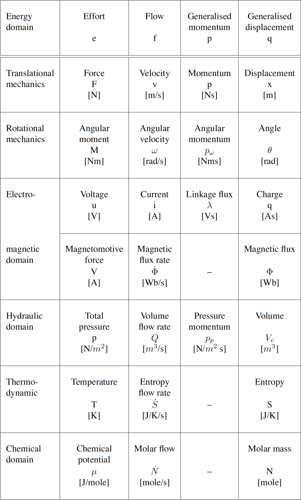
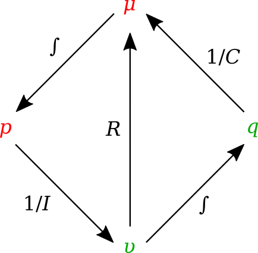
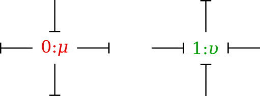

.. _dtp_cp_modellingbestpractices:

==============================================
Introduction to (ODE) Modelling Best Practices
==============================================

.. contents:: Contents:

In this part of the computational physiology module we demonstrate some modelling practices that we recommend you follow when developing any mathematical model. The key principles are **modularity**, **reuse**, and **reproducibility** - we demonstrate those here using the tool `OpenCOR <http://opencor.ws>`_ and the `CellML <http://cellml.org>`_ and `SED-ML <http://sed-ml.org>`_  formats, but the principles are valid across the spectrum of computational physiology. It is also important to be able to share and collaborate with other scientists and we demonstrate this using the Physiome Model Repository (PMR).

Here are a couple of links in case you need a refer back to some of the material covered earlier in the module.

* :ref:`cellml_opencor_pmr_tutorial__first_model`
* :ref:`cellml_opencor_pmr_tutorial__open_existing`
* :ref:`cellml_opencor_pmr_tutorial__sedml_web_lab`

Reproducible and reusable model descriptions
============================================

In this section we introduce some of the *key concepts* and *best practices* for ensuring your mathematical models are reproducible and reusable.

Units
-----

.. toctree::
   :hidden:

   opencor-tutorial/source/cellml_units

The **first concept** is that everything in your model should have clearly defined physical dimensions (or at least a clear statement that the quantity has no physical dimension). This ensures that when a scientist reuses a model they are able to use software tools to check for dimensional consistency and even potentially automatically convert quantities as required.

* Take a look through the section :ref:`cellml_opencor_pmr_tutorial__cellml_units` for a discussion and some examples demonstrating the use of units in CellML and OpenCOR.

Modularity
----------

.. toctree::
   :hidden:

   opencor-tutorial/source/cellml_comp_and_conn
   opencor-tutorial/source/cellml_encaps_and_inter

The **second concept** is that of modularity. By defining your mathematical model in a modular fashion with clearly defined interfaces you ensure that other scientists (and even yourself!) are able to make sure of the modules in future novel work.

* The section :ref:`ocr_tut_intro_cellml_comp_conn` provides an introduction to the syntax for defining modules in CellML and the mechanism for defining the communication between the modules.

* :ref:`ocr_tut_intro_cellml_encaps_inter` then introduces the concept of hierarchically grouping modules as an aide to reuse and abstraction, as well as definition of module interfaces.

Reuse
-----

.. toctree::
   :hidden:

   opencor-tutorial/source/cellml_imports
   opencor-tutorial/source/cellml_import_unit_params

The final **key concept** is that of reusing existing modules, defined using the previous concepts.

* :ref:`ocr_tut_intro_cellml_imports` introduces the mechanism by which existing modules can be reused in CellML models.

When describing your model it is useful to separate the mathematical model from its instaniation with a specific set of parameter values. This allows the model to be reused with different parameter sets for different purposes, including different simulation protocols, etc. Furthermore, rather than continually redefining the same set of units, it is better practice to simply define your units once and reuse their definition as required. Potentially even defining a standard set of units for a research group or collaboration to use and storing that in the repository for everyone to make use of.

* In :ref:`ocr_tut_intro_cellml_import_unit_params` we demonstrate the separation of model parameters and reuse of a common units definition.

Collaboration, versioning, discovery
====================================

.. toctree::
   :hidden:

   opencor-tutorial/source/pmr
   opencor-tutorial/source/pmr_workspaces_in_opencor

One of the main reasons to encode your mathematical models following the principles described in the previous sections is to make the model available for future scientists (again, including yourself!) to utilise the model in novel investigations. The Physiome Model Repository (`PMR <https://models.physiomeproject.org/>`_) has been developed to provide scientists with a suitable repository for sharing their work with the community. Full details are provided in the `PMR documentation <https://models.physiomeproject.org/docs>`_, but here we highlight some PMR capabilities.

* We have :ref:`previously introduced <cellml_opencor_pmr_tutorial__open_existing>` the various ways to load models from PMR into OpenCOR. In :ref:`cellml_opencor_pmr_tutorial__pmr_intro` we illustrate some of the extra information that is available via the PMR web interface.

* Choosing your favourite area of physiology, see if you can discover an interesting model in PMR and load it into OpenCOR to explore. Do you find this a more comprehensive way to understand the model than only reading the source literature?

The primary unit of information in PMR is the workspace. Each workspace is a version controlled repository which is permanently and persistently available, with each resource in the workspace assigned a unique identifier for each version of the resource submitted to the repository.

* In :ref:`cellml_opencor_pmr_tutorial__pmr_with_opencor` we present OpenCOR's capabilties for directly working with workspaces in PMR.

* Compare the method described in step 8 with the `previous method scientists had to follow <http://aucklandphysiomerepository.readthedocs.io/en/latest/cellmlrepositorytutorial.html>`_ in order to get models into PMR. Do you see why most scientists would prefer to email their models to Andre and let him add them to the repository?

* Using what you have just learnt, create a new workspace and add the models you created above to the workspace. Make sure that you can see the models in the web interface (you can easily access the workspace URL using the context menu in the :guilabel:`PMR Workspaces` window in OpenCOR).

* As we have mentioned :ref:`previously <cellml_opencor_pmr_tutorial__sedml_web_lab>`, it is possible to export SED-ML from OpenCOR containing all your graph and simulation settings. Try exporting SED-ML for one of the models you created above and also saving it in th e PMR workspace you have created.

* Once you are happy with the content of your worspace and have everything synchronised with the repository, you can :ref:`submit your workspace for publication <publishingWorkspaces>`. This will notify the tutors to check your workspace and see if they can reproduce your simulation experiments.

**Extra for experts:**  if you look through the :ref:`PMR documentation <abi-pmr2-index>` you will be able to find information on how to share your worksapces directly with collaborators and make *exposures* for specific revisions of the workspace.

A bond graph-based method for representing physiology
=====================================================

A new field of research that has emerged recently is the application of bond graph theory to the field of systems biology and physiology. This is providing the theoretical framework to guide the development of core modules that can be arbitrarily combined to capture a wide range of physiological phenomena. Combining this framework with CellML has started to provide an extremely powerful technology for both defining core modules spanning the required physics and the methods for integrating these modules into models of physiological systems.

Introduction
------------

The bond graph approach to formulating models dealing with mass and energy transfer was developed by Henry Paynter in the 1960s to represent electro-mechanical control systems :cite:`paynter1961analysis`. It was later extended to include chemical processes by :cite:`breedveld1984physical`, including concepts from the theory of network thermodynamics by Aharon Katchalsky and colleagues :cite:`oster1971network`. Papers by Peter Gawthrop and Edmund Crampin have brought the approach into the bioengineering domain :cite:`gawthrop2014energy,gawthrop2015hierarchical,gawthrop2015energetic,gawthrop2016modular`.

The **first** key idea, based on recognising that energy and power are the only quantities that are common across different physical systems, is to separate energy transmission from storage and dissipation, and to provide the concept of *potential* (called "effort" in the engineering literature) with units of Joules per some_quantity as the common driving force behind the *flow* of that some_quantity per second. The product of potential and flow is then always power in units of Joules per second. The "some_quantity" has units of metres, meters\ :sup:`3`\, coulombs, candela, moles or entropy for, respectively, rigid body mechanics, continuum mechanics (including fluid flow), electrical, electromagnetic, chemical and heat transfer processes. As explained further below, the **second** key concept is that of a *0-junction*, where potential is defined and mass balance is applied, and a *1-junction*, where flow is defined and energy balance is applied. The extraordinary utility of these concepts is to recognise that Kirchhoff's voltage law in electrical circuits, Newton's force balance in a mechanical system, and stoichiometric balance in a biochemical system, are all just different manifestations of the same underlying principle of energy conservation and can therefore be represented by the same bond graph equation.

Units
-----

Many physical systems can be described by a driving *potential* expressed as Joules per unit of some quantity, and a *flow* expressed as that quantity per second. The quantity could be coulomb, meters, moles, *etc.* in different physical systems. The power is always the product of the driving force and the flow expressed as Joules per second. The seven units of the SI system under the newly proposed definitions are now based on constants that are consistent with the use of Joules and seconds (together covering energy and power), metres, moles, entropy, coulombs and candela. :numref:`fig_dtp_cp_bondgraphproject_table` displays the bond graph concepts in different energy domains.

.. _fig_dtp_cp_bondgraphproject_table:

   Power and energy variables in various energy domains.

Formulation
-----------

In bond graph formulation, there are four basic variables. These variables for different physical systems are listed in . In electrical engineering these variables are given by: potential :math:`\mu` is energy density or `voltage` (J.C :sup:`-1`), flow :math:`\upsilon` is `current` (C.s :sup:`-1`), time integral of potential :math:`p` is `momentum` (J.s.C :sup:`-1`) and time integral of flow :math:`q` is quantity or `coulombs` (C). Product :math:`\mu .\upsilon` is power (J.s :sup:`-1`) which is a generalised coordinate to model the complete systems residing in several energy domains. A bond with covariables :math:`\mu` and :math:`\upsilon` is therefore used to represent `transmission of energy`. The bond represents a mechanism for the transmission of energy and power, and the arrow head indicates the assumed direction of power flow (see :numref:`fig_dtp_cp_bondgraphproject_bond`). The flow :math:`\upsilon` and potential :math:`\mu` must satisfy conservation laws.

.. _fig_dtp_cp_bondgraphproject_bond:

.. figure:: _static/bond.png
   :align: center
   :width: 25%

   Representation of energy bond.

Bond graph elements
-------------------

Bond graph formulation is a graphical notation for the set of linear constraint equations (the conservation laws), but the constitutive relations can be nonlinear.

The constitutive equations of the bond graph elements are introduced via examples from the electrical and mechanical domains. The nature of the constitutive equations lay demands on the causality of the connected bonds. Bond graph elements are drawn as letter combinations (mnemonic codes) indicating the type of element. The bond graph elements are the following:

* `C`: static storage element, `e.g.` capacitor (stores charge), spring (stores displacement).

* `I`: dynamic storage element, `e.g.` inductor (stores flux linkage), mass (stores momentum).

* `R`: resistor dissipating free energy, `e.g.` electric resistor, mechanical friction.

* `SE` and `SF`: sources, `e.g.` electric mains (voltage source), gravity (force source), pump (flow source).

* `TF`: transformer, `e.g.` an electric transformer, toothed wheels, lever.

* `GY`: gyrator, `e.g.` electromotor, centrifugal pump.

* `0` and `1`: `0-junctions` and `1-junctions`, for ideal connecting two or more submodels.

:numref:`fig_dtp_cp_bondgraphproject_tetra` shows the relation of the state variables to the constitutive relations.

.. _fig_dtp_cp_bondgraphproject_tetra:

   State variables and constitutive relations in the bond graph approach.

Storage elements
~~~~~~~~~~~~~~~~

Storage elements store all kinds of free energy. As indicated above, there are two types of storage elements: `C-elements` and `I-elements`. In `C-elements`, like a capacitor or spring, the conserved quantity, `q`, is stored by accumulating the net flow, :math:`\upsilon`, to the storage element. This results in the differential equation:

.. math::

   \dot q=\upsilon

which is called a balance equation, and forms a part of the constitutive equations of the storage element. In the other part of the constitutive equations, the state variable, `q`, is related to the potential:

.. math::

   \mu=\dfrac{q}{C}

In `I–elements`, like an inductor or mass, the conserved quantity, `p`, is stored by accumulating the net potential, :math:`\mu`, to the storage element. The resulting differential equation is:

.. math::

   \dot p=\mu

which is the balance equation. The element-specific part of the constitutive equations is:

.. math::

   \upsilon=\dfrac{p}{I}

Resistors
~~~~~~~~~

Resistors, `R–elements`, dissipate free energy. Examples are dampers, frictions and electric resistors. The constitutive equation is an algebraic relation between the potential and flow.

.. math::

   \mu=\upsilon R

Sources
~~~~~~~

Sources represent the interaction of a system with its environment. Examples are external forces, voltage and current sources, ideal motors, `etc.` Depending on the type of the imposed variable, these elements are drawn as `SE` or `SF`.

Transformers
~~~~~~~~~~~~

An ideal transformer is represented by `TF` and is power continuous (`i.e.` no power is stored or dissipated). The transformation can within the same domain (toothed wheel, lever) or between different domains (electromotor, winch). The equations are:

.. math::

   \mu_1=n \mu_2

.. math::

   \upsilon_2=n \upsilon_1

Potentials are transduced to potentials and flows to flows. The parameter `n` is the transformer ratio. Due to the power continuity, only one dimensionless parameter, `n`, is needed to describe both the potential transduction and the flow transduction. The parameter `n` is unambiguously defined as follows: :math:`\mu`:sub:`1` and :math:`\upsilon`:sub:`1` belong to the bond pointing towards the `TF`. If `n` is not constant, the transformer is a modulated transformer, a `MTF`. The transformer ratio now becomes an input signal to the `MTF`.

Gyrators
~~~~~~~~

An ideal `gyrator` is represented by `GY`, and is also power continuous (`i.e.` no power is stored or is dissipated. Examples are an electromotor, a pump and a turbine. Real-life realisations of gyrators are mostly transducers representing a domain-transformation. The equations are:

  .. math::

     \mu_1=r \upsilon_2

  .. math::

     \mu_2=r \upsilon_1

The parameter `r` is the `gyrator ratio`, and due to the power continuity, only one parameter to describe both equations. No further definition is needed since the equations are symmetric (it does not matter which bond points inwards, only that one bond points towards and the other points form the gyrator). `r` has a physical dimension, since `r` is a relation between effort and flow (it has the same dimension as the parameter of the `R-element`). If `r` is not constant, the gyrator is a `modulated gyrator`, a `MGY`.

Junctions
~~~~~~~~~

Junctions couple two or more elements in a power continuous way: there is no energy storage or dissipation in a junction. Examples are a series connection or a parallel connection in an electrical network, a fixed coupling between parts of a mechanical system.

The `0-junction` represents a node at which all potentials of the connecting bonds are equal. An example is a parallel connection in an electrical circuit. Due to the power continuity, the sum of the flows of the connecting bonds is zero, considering the sign. The power direction (`i.e.` direction of the arrow) determines the sign of the flows: all inward pointing bonds get a plus and all outward pointing bonds get a minus. This summation is the Kirchhoff current law in electrical networks: all currents connecting to one node sum to zero, considering their signs: all inward currents are positive and all outward currents are negative. We can depict the `0-junction` as the representation of a potential variable, and often the `0-junction` will be interpreted as such. The `0-junction` is more than the (generalised) Kirchhoff current law, namely also the equality of the potentials (like electrical voltages being equal at a parallel connection).

The `1-junction` is the dual form of the `0-junction` (roles of potential and flow are exchanged). The `1-junction` represents a node at which all flows of the connecting bonds are equal. An example is a series connection in an electrical circuit. The potentials sum to zero, as a consequence of the power continuity. Again, the power direction (`i.e.` direction of the arrow) determines the sign of the potentials: all inward pointing bonds get a plus and all outward pointing bonds get a minus. This summation is the Kirchhoff voltage law in electrical networks: the sum of all voltage differences along one closed loop (a mesh) is zero. In the mechanical domain, the `1–junction` represents a force balance (also called the principle of d’Alembert), and is a generalisation of Newton’s third law, action = – reaction). Just as with the `0–junction`, the `1–junction` is more than these summations, namely the equality of the flows. Therefore, we can depict the `1–junction` as the representation of a flow variable, and often the `1-junction` will be interpreted as such.

Causality
~~~~~~~~~

Causality establishes the cause and the effect relationship. It specifically implies that either the potential or flow variable on that bond is known. Causality is generally indicated by a causal stroke at the end to which the potential receiver is connected. Elements which store or dissipate energy do not impose causality on the system, but they have preferred causality for computational reasons. These elements with their preferred causality are shown in :numref:`fig_dtp_cp_bondgraphproject_causality_element`.

.. _fig_dtp_cp_bondgraphproject_causality_element:

.. figure:: _static/causality_element.png
   :align: center
   :width: 25%

   Preferred causality for `R`, `C`, and `I` elements.

In the bond graph approach, junctions interconnect the corresponding elements and constrain the possible causalities of the element ports connected to it. A `0-junction` can only have one potential output. In a similar way, a `1-junction` can only have one flow output. :numref:`fig_dtp_cp_bondgraphproject_causality_jun` illustrates causality in four-port `0-junction` and `1-junction`.

.. _fig_dtp_cp_bondgraphproject_causality_jun:

   Causality in four-port `0-junction` and `1-junction`.

Procedure
---------

To generate a bond graph model starting from an ideal-physical model (IPM), a systematic method exist, which we will present here as a procedure. This procedure consists roughly of the identification of the domains and basic elements, the generation of the connection structure (called the junction structure), the placement of the elements, and possibly simplifying the graph. The procedure is different for the mechanical domain compared to the other domains. These differences are indicated between parenthesis. The reason is that elements need to be connected to difference variables or across variables. The potentials in the non-mechanical domains and the flows in the mechanical domains are the across variables we need.

Step 1 and 2 concern the identification of the domains and elements.

1. Determine which physical domains exist in the system and identify all basic elements like *C*, *I*, *R*, *SE*, *SF*, *TF* and *GY*. Give every element a unique name to distinguish them from each other.

2. Indicate in the ideal-physical model per domain a reference potential (reference flow with positive direction for the mechanical domains). Note that only the references in the mechanical domains have a direction.

Steps 3 through 6 describe the generation of the connection structure (called the junction structure).

3. Identify all other potentials (mechanical domains: flows) and give them unique names.

4. Draw these potentials (mechanical: flows), and not the references, graphically by `0-junctions` (mechanical: `1-junctions`). Keep if possible, the same layout as the IPM.

5. Identify all potential differences (mechanical: flow differences) needed to connect the ports of all elements enumerated in step 1 to the junction structure. Give these differences a unique name, preferably showing the difference nature. The difference between  :math:`\mu`:sub:`1` and :math:`\mu`:sub:`2` can be indicated by :math:`\mu` :sub:`12`.

6. Construct the potential differences using a `1-junction` (mechanical: flow differences with a `0-junction`) and draw them as such in the graph. The junction structure is now ready and the elements can be connected.

7. Connect the port of all elements found at step 1 with the `0-junctions` of the corresponding potential or potential differences (mechanical: `1-junctions` of the corresponding flows or flow differences).

8. Simplify the resulting graph by applying the following simplification rules:

   * A junction between two bonds can be left out, if the bonds have a ‘through’ power direction (one bond incoming, the other outgoing).

   * A bond between two the same junctions can be left out, and the junctions can join into one junction.

   * Two separately constructed identical potential or flow differences can join into one potential or flow difference.

We will illustrate these steps with a concrete example in the next section.

As this is a new and rapidly evolving field of research, the documentation is still being developed. This section of the DTP Computational Physiology module will be largely be taught using powerpoint slides that are available :download:`here <_static/BG Composite 2017-07-17.pdf>`.

Some references that are relevant to this work are given here for convenience.

* Paynter H. Analysis and Design of Engineering Systems (MIT, Cambridge, Mass., 1961).
* Oster G, Perelson A, and Katchalsky A. 1971. Network thermodynamics. *Nature* (Lond.). 234:393 (`link <http://www.nature.com/nature/journal/v234/n5329/abs/234393a0.html>`_).
* Gawthrop PJ and Crampin EJ. Energy based analysis of biochemical cycles using bond graphs. *Proc. R. Soc. A* 470:20140459, 2014 (`link <http://rspa.royalsocietypublishing.org/content/470/2171/20140459>`_).
* Gawthrop PJ and Crampin EJ. Modular bond-graph modelling and analysis of biomolecularsystems. *IET Systems Biology*, 2015 (`link <http://dx.doi.org/10.1049/iet-syb.2015.0083>`_).
* Gawthrop PJ, Cursons J and Crampin EJ. Hierarchical bond graph modelling of biochemical networks. *Proc. R. Soc A*, 471(2184), 2015 (`link <http://rspa.royalsocietypublishing.org/content/471/2184/20150642>`_).
* Gawthrop PJ, Siekmann I, Kameneva T, Saha S, Ibbotson MR and Crampin EJ. The energetic cost of the action potential: bond graph modelling of electrochemical energy transduction in excitable membranes. arXiv:1512.00956 (`link <https://arxiv.org/abs/1512.00956>`_).
* Broenink, JF. 1999. Introduction to physical systems modelling with bond graphs. SiE Whitebook on Simulation Methodologies, 31.

Example models
--------------

A collection of models is available for this section of the module. The following steps can be used to create your own copy of these models for use in the tutorial.

#. Go to http://teaching.physiomeproject.org/workspace/2cd in your web browser.
#. Make sure you are logged in to the teaching instance of PMR.
#. Click on :guilabel:`Fork` in the workspace menu, followed by the :guilabel:`Fork` button. This will create your own private copy of the workspace containing these example models.
#. In OpenCOR, make sure you are :ref:`logged into the teaching instance of PMR <cellml_opencor_pmr_tutorial__pmr_with_opencor>`.
#. You might need to click the :guilabel:`Reload` button (green arrow) to update the window to show your copy of the :guilabel:`Example bond graph models` workspace.
#. Right-click on the example bond graph models workspace folder and :menuselection:`Make Local Workspace Copy...` the workspace (as per :ref:`step 5 <cellml_opencor_pmr_tutorial__pmr_with_opencor>`).

You will now have a copy of the example models on your computer.

