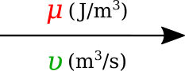
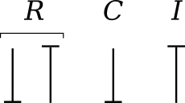

.. _dtp_cp_modellingbestpractices:

==============================================
Introduction to (ODE) Modelling Best Practices
==============================================

.. contents:: Contents:

In this part of the computational physiology module we demonstrate some modelling practices that we recommend you follow when developing any mathematical model. The key principles are **modularity**, **reuse**, and **reproducibility** - we demonstrate those here using the tool `OpenCOR <http://opencor.ws>`_ and the `CellML <http://cellml.org>`_ and `SED-ML <http://sed-ml.org>`_  formats, but the principles are valid across the spectrum of computational physiology. It is also important to be able to share and collaborate with other scientists and we demonstrate this using the Physiome Model Repository (PMR).

Here are a couple of links in case you need a refer back to some of the material covered earlier in the module.

* :ref:`cellml_opencor_pmr_tutorial__first_model`
* :ref:`cellml_opencor_pmr_tutorial__open_existing`
* :ref:`cellml_opencor_pmr_tutorial__sedml_web_lab`

Reproducible and reusable model descriptions
============================================

In this section we introduce some of the *key concepts* and *best practices* for ensuring your mathematical models are reproducible and reusable.

Units
-----

.. toctree::
   :hidden:

   opencor-tutorial/source/cellml_units

The **first concept** is that everything in your model should have clearly defined physical dimensions (or at least a clear statement that the quantity has no physical dimension). This ensures that when a scientist reuses a model they are able to use software tools to check for dimensional consistency and even potentially automatically convert quantities as required.

* Take a look through the section :ref:`cellml_opencor_pmr_tutorial__cellml_units` for a discussion and some examples demonstrating the use of units in CellML and OpenCOR.

Modularity
----------

.. toctree::
   :hidden:

   opencor-tutorial/source/cellml_comp_and_conn
   opencor-tutorial/source/cellml_encaps_and_inter

The **second concept** is that of modularity. By defining your mathematical model in a modular fashion with clearly defined interfaces you ensure that other scientists (and even yourself!) are able to make sure of the modules in future novel work.

* The section :ref:`ocr_tut_intro_cellml_comp_conn` provides an introduction to the syntax for defining modules in CellML and the mechanism for defining the communication between the modules.

* :ref:`ocr_tut_intro_cellml_encaps_inter` then introduces the concept of hierarchically grouping modules as an aide to reuse and abstraction, as well as definition of module interfaces.

Reuse
-----

.. toctree::
   :hidden:

   opencor-tutorial/source/cellml_imports
   opencor-tutorial/source/cellml_import_unit_params

The final **key concept** is that of reusing existing modules, defined using the previous concepts.

* :ref:`ocr_tut_intro_cellml_imports` introduces the mechanism by which existing modules can be reused in CellML models.

When describing your model it is useful to separate the mathematical model from its instaniation with a specific set of parameter values. This allows the model to be reused with different parameter sets for different purposes, including different simulation protocols, etc. Furthermore, rather than continually redefining the same set of units, it is better practice to simply define your units once and reuse their definition as required. Potentially even defining a standard set of units for a research group or collaboration to use and storing that in the repository for everyone to make use of.

* In :ref:`ocr_tut_intro_cellml_import_unit_params` we demonstrate the separation of model parameters and reuse of a common units definition.

Collaboration, versioning, discovery
====================================

.. toctree::
   :hidden:

   opencor-tutorial/source/pmr
   opencor-tutorial/source/pmr_workspaces_in_opencor

One of the main reasons to encode your mathematical models following the principles described in the previous sections is to make the model available for future scientists (again, including yourself!) to utilise the model in novel investigations. The Physiome Model Repository (`PMR <https://models.physiomeproject.org/>`_) has been developed to provide scientists with a suitable repository for sharing their work with the community. Full details are provided in the `PMR documentation <https://models.physiomeproject.org/docs>`_, but here we highlight some PMR capabilities.

* We have :ref:`previously introduced <cellml_opencor_pmr_tutorial__open_existing>` the various ways to load models from PMR into OpenCOR. In :ref:`cellml_opencor_pmr_tutorial__pmr_intro` we illustrate some of the extra information that is available via the PMR web interface.

* Choosing your favourite area of physiology, see if you can discover an interesting model in PMR and load it into OpenCOR to explore. Do you find this a more comprehensive way to understand the model than only reading the source literature?

The primary unit of information in PMR is the workspace. Each workspace is a version controlled repository which is permanently and persistently available, with each resource in the workspace assigned a unique identifier for each version of the resource submitted to the repository.

* In :ref:`cellml_opencor_pmr_tutorial__pmr_with_opencor` we present OpenCOR's capabilties for directly working with workspaces in PMR.

* Compare the method described in step 8 with the `previous method scientists had to follow <http://aucklandphysiomerepository.readthedocs.io/en/latest/cellmlrepositorytutorial.html>`_ in order to get models into PMR. Do you see why most scientists would prefer to email their models to Andre and let him add them to the repository?

* Using what you have just learnt, create a new workspace and add the models you created above to the workspace. Make sure that you can see the models in the web interface (you can easily access the workspace URL using the context menu in the :guilabel:`PMR Workspaces` window in OpenCOR).

* As we have mentioned :ref:`previously <cellml_opencor_pmr_tutorial__sedml_web_lab>`, it is possible to export SED-ML from OpenCOR containing all your graph and simulation settings. Try exporting SED-ML for one of the models you created above and also saving it in th e PMR workspace you have created.

* Once you are happy with the content of your worspace and have everything synchronised with the repository, you can :ref:`submit your workspace for publication <publishingWorkspaces>`. This will notify the tutors to check your workspace and see if they can reproduce your simulation experiments.

**Extra for experts:**  if you look through the :ref:`PMR documentation <abi-pmr2-index>` you will be able to find information on how to share your worksapces directly with collaborators and make *exposures* for specific revisions of the workspace.

A bond graph-based method for representing physiology
=====================================================

A new field of research that has emerged recently is the application of bond graph theory to the field of systems biology and physiology. This is providing the theoretical framework to guide the development of core modules that can be arbitrarily combined to capture a wide range of physiological phenomena. Combining this framework with CellML has started to provide an extremely powerful technology for both defining core modules spanning the required physics and the methods for integrating these modules into models of physiological systems.

Introduction
------------

The bond graph approach to formulating models dealing with mass and energy transfer was developed by Henry Paynter in the 1960s to represent electro-mechanical control systems :cite:`paynter1961analysis`. It was later extended to include chemical processes by :cite:`breedveld1984physical`, including concepts from the theory of network thermodynamics by Aharon Katchalsky and colleagues :cite:`oster1971network`. Papers by Peter Gawthrop and Edmund Crampin have brought the approach into the bioengineering domain :cite:`gawthrop2014energy,gawthrop2015hierarchical,gawthrop2015energetic,gawthrop2016modular`.

The **first** key idea, based on recognising that energy and power are the only quantities that are common across different physical systems, is to separate energy transmission from storage and dissipation, and to provide the concept of *potential* (called "effort" in the engineering literature) with units of Joules per some_quantity as the common driving force behind the *flow* of that some_quantity per second. The product of potential and flow is then always power in units of Joules per second. The "some_quantity" has units of metres, meters\ :sup:`3`\, coulombs, candela, moles or entropy for, respectively, rigid body mechanics, continuum mechanics (including fluid flow), electrical, electromagnetic, chemical and heat transfer processes. As explained further below, the **second** key concept is that of a *0-junction*, where potential is defined and mass balance is applied, and a *1-junction*, where flow is defined and energy balance is applied. The extraordinary utility of these concepts is to recognise that Kirchhoff's voltage law in electrical circuits, Newton's force balance in a mechanical system, and stoichiometric balance in a biochemical system, are all just different manifestations of the same underlying principle of energy conservation and can therefore be represented by the same bond graph equation.

Units
-----

Many physical systems can be described by a driving *potential* expressed as Joules per unit of some quantity, and a *flow* expressed as that quantity per second. The quantity could be coulomb, meters, moles, *etc.* in different physical systems. The power is always the product of the driving force and the flow expressed as Joules per second. The seven units of the SI system under the newly proposed definitions are now based on constants that are consistent with the use of Joules and seconds (together covering energy and power), metres, moles, entropy, coulombs and candela. :numref:`fig_dtp_cp_bondgraphproject_table` displays the bond graph concepts in different energy domains.

.. _fig_dtp_cp_bondgraphproject_table:

.. figure:: _static/table.png
   :align: center
   :width: 75%

   Power and energy variables in various energy domains.

Formulation
-----------

In bond graph formulation, there are four basic variables. These variables for different physical systems are listed in . In electrical engineering these variables are given by: potential :math:`\mu` is energy density or `voltage` (J.C :sup:`-1`), flow :math:`\upsilon` is `current` (C.s :sup:`-1`), time integral of potential :math:`p` is `momentum` (J.s.C :sup:`-1`) and time integral of flow :math:`q` is quantity or `coulombs` (C). Product :math:`\mu .\upsilon` is power (J.s :sup:`-1`) which is a generalised coordinate to model the complete systems residing in several energy domains. A bond with covariables :math:`\mu` and :math:`\upsilon` is therefore used to represent `transmission of energy`. The bond represents a mechanism for the transmission of energy and power, and the arrow head indicates the assumed direction of power flow (see :numref:`fig_dtp_cp_bondgraphproject_bond`). The flow :math:`\upsilon` and potential :math:`\mu` must satisfy conservation laws.

.. _fig_dtp_cp_bondgraphproject_bond:

   Representation of energy bond.

Bond graph elements
-------------------

Bond graph formulation is a graphical notation for the set of linear constraint equations (the conservation laws), but the constitutive relations can be nonlinear.

The constitutive equations of the bond graph elements are introduced via examples from the electrical and mechanical domains. The nature of the constitutive equations lay demands on the causality of the connected bonds. Bond graph elements are drawn as letter combinations (mnemonic codes) indicating the type of element. The bond graph elements are the following:

* `C`: static storage element, `e.g.` capacitor (stores charge), spring (stores displacement).

* `I`: dynamic storage element, `e.g.` inductor (stores flux linkage), mass (stores momentum).

* `R`: resistor dissipating free energy, `e.g.` electric resistor, mechanical friction.

* `SE` and `SF`: sources, `e.g.` electric mains (voltage source), gravity (force source), pump (flow source).

* `TF`: transformer, `e.g.` an electric transformer, toothed wheels, lever.

* `GY`: gyrator, `e.g.` electromotor, centrifugal pump.

* `0` and `1`: `0-junctions` and `1-junctions`, for ideal connecting two or more submodels.

:numref:`fig_dtp_cp_bondgraphproject_tetra` shows the relation of the state variables to the constitutive relations.

.. _fig_dtp_cp_bondgraphproject_tetra:

   State variables and constitutive relations in the bond graph approach.

Storage elements
~~~~~~~~~~~~~~~~

Storage elements store all kinds of free energy. As indicated above, there are two types of storage elements: `C-elements` and `I-elements`. In `C-elements`, like a capacitor or spring, the conserved quantity, `q`, is stored by accumulating the net flow, :math:`\upsilon`, to the storage element. This results in the differential equation:

.. math::

   \dot q=\upsilon

which is called a balance equation, and forms a part of the constitutive equations of the storage element. In the other part of the constitutive equations, the state variable, `q`, is related to the potential:

.. math::

   \mu=\dfrac{q}{C}

In `I–elements`, like an inductor or mass, the conserved quantity, `p`, is stored by accumulating the net potential, :math:`\mu`, to the storage element. The resulting differential equation is:

.. math::

   \dot p=\mu

which is the balance equation. The element-specific part of the constitutive equations is:

.. math::

   \upsilon=\dfrac{p}{I}

Resistors
~~~~~~~~~

Resistors, `R–elements`, dissipate free energy. Examples are dampers, frictions and electric resistors. The constitutive equation is an algebraic relation between the potential and flow.

.. math::

   \mu=\upsilon R

Sources
~~~~~~~

Sources represent the interaction of a system with its environment. Examples are external forces, voltage and current sources, ideal motors, `etc.` Depending on the type of the imposed variable, these elements are drawn as `SE` or `SF`.

Transformers
~~~~~~~~~~~~

An ideal transformer is represented by `TF` and is power continuous (`i.e.` no power is stored or dissipated). The transformation can within the same domain (toothed wheel, lever) or between different domains (electromotor, winch). The equations are:

.. math::

   \mu_1=n \mu_2

.. math::

   \upsilon_2=n \upsilon_1

Potentials are transduced to potentials and flows to flows. The parameter `n` is the transformer ratio. Due to the power continuity, only one dimensionless parameter, `n`, is needed to describe both the potential transduction and the flow transduction. The parameter `n` is unambiguously defined as follows: :math:`\mu`:sub:`1` and :math:`\upsilon`:sub:`1` belong to the bond pointing towards the `TF`. If `n` is not constant, the transformer is a modulated transformer, a `MTF`. The transformer ratio now becomes an input signal to the `MTF`.

Gyrators
~~~~~~~~

An ideal `gyrator` is represented by `GY`, and is also power continuous (`i.e.` no power is stored or is dissipated. Examples are an electromotor, a pump and a turbine. Real-life realisations of gyrators are mostly transducers representing a domain-transformation. The equations are:

  .. math::

     \mu_1=r \upsilon_2

  .. math::

     \mu_2=r \upsilon_1

The parameter `r` is the `gyrator ratio`, and due to the power continuity, only one parameter to describe both equations. No further definition is needed since the equations are symmetric (it does not matter which bond points inwards, only that one bond points towards and the other points form the gyrator). `r` has a physical dimension, since `r` is a relation between effort and flow (it has the same dimension as the parameter of the `R-element`). If `r` is not constant, the gyrator is a `modulated gyrator`, a `MGY`.

Junctions
~~~~~~~~~

Junctions couple two or more elements in a power continuous way: there is no energy storage or dissipation in a junction. Examples are a series connection or a parallel connection in an electrical network, a fixed coupling between parts of a mechanical system.

The `0-junction` represents a node at which all potentials of the connecting bonds are equal. An example is a parallel connection in an electrical circuit. Due to the power continuity, the sum of the flows of the connecting bonds is zero, considering the sign. The power direction (`i.e.` direction of the arrow) determines the sign of the flows: all inward pointing bonds get a plus and all outward pointing bonds get a minus. This summation is the Kirchhoff current law in electrical networks: all currents connecting to one node sum to zero, considering their signs: all inward currents are positive and all outward currents are negative. We can depict the `0-junction` as the representation of a potential variable, and often the `0-junction` will be interpreted as such. The `0-junction` is more than the (generalised) Kirchhoff current law, namely also the equality of the potentials (like electrical voltages being equal at a parallel connection).

The `1-junction` is the dual form of the `0-junction` (roles of potential and flow are exchanged). The `1-junction` represents a node at which all flows of the connecting bonds are equal. An example is a series connection in an electrical circuit. The potentials sum to zero, as a consequence of the power continuity. Again, the power direction (`i.e.` direction of the arrow) determines the sign of the potentials: all inward pointing bonds get a plus and all outward pointing bonds get a minus. This summation is the Kirchhoff voltage law in electrical networks: the sum of all voltage differences along one closed loop (a mesh) is zero. In the mechanical domain, the `1–junction` represents a force balance (also called the principle of d’Alembert), and is a generalisation of Newton’s third law, action = – reaction). Just as with the `0–junction`, the `1–junction` is more than these summations, namely the equality of the flows. Therefore, we can depict the `1–junction` as the representation of a flow variable, and often the `1-junction` will be interpreted as such.

Causality
~~~~~~~~~

Causality establishes the cause and the effect relationship. It specifically implies that either the potential or flow variable on that bond is known. Causality is generally indicated by a causal stroke at the end to which the potential receiver is connected. Elements which store or dissipate energy do not impose causality on the system, but they have preferred causality for computational reasons. These elements with their preferred causality are shown in :numref:`fig_dtp_cp_bondgraphproject_causality_element`.

.. _fig_dtp_cp_bondgraphproject_causality_element:

   Preferred causality for `R`, `C`, and `I` elements.

In the bond graph approach, junctions interconnect the corresponding elements and constrain the possible causalities of the element ports connected to it. A `0-junction` can only have one potential output. In a similar way, a `1-junction` can only have one flow output. :numref:`fig_dtp_cp_bondgraphproject_causality_jun` illustrates causality in four-port `0-junction` and `1-junction`.

.. _fig_dtp_cp_bondgraphproject_causality_jun:

   Causality in four-port `0-junction` and `1-junction`.

Procedure
---------

To generate a bond graph model starting from an ideal-physical model (IPM), a systematic method exist, which we will present here as a procedure. This procedure consists roughly of the identification of the domains and basic elements, the generation of the connection structure (called the junction structure), the placement of the elements, and possibly simplifying the graph. The procedure is different for the mechanical domain compared to the other domains. These differences are indicated between parenthesis. The reason is that elements need to be connected to difference variables or across variables. The potentials in the non-mechanical domains and the flows in the mechanical domains are the across variables we need.

Step 1 and 2 concern the identification of the domains and elements.

1. Determine which physical domains exist in the system and identify all basic elements like *C*, *I*, *R*, *SE*, *SF*, *TF* and *GY*. Give every element a unique name to distinguish them from each other.

2. Indicate in the ideal-physical model per domain a reference potential (reference flow with positive direction for the mechanical domains). Note that only the references in the mechanical domains have a direction.

Steps 3 through 6 describe the generation of the connection structure (called the junction structure).

3. Identify all other potentials (mechanical domains: flows) and give them unique names.

4. Draw these potentials (mechanical: flows), and not the references, graphically by `0-junctions` (mechanical: `1-junctions`). Keep if possible, the same layout as the IPM.

5. Identify all potential differences (mechanical: flow differences) needed to connect the ports of all elements enumerated in step 1 to the junction structure. Give these differences a unique name, preferably showing the difference nature. The difference between  :math:`\mu`:sub:`1` and :math:`\mu`:sub:`2` can be indicated by :math:`\mu` :sub:`12`.

6. Construct the potential differences using a `1-junction` (mechanical: flow differences with a `0-junction`) and draw them as such in the graph. The junction structure is now ready and the elements can be connected.

7. Connect the port of all elements found at step 1 with the `0-junctions` of the corresponding potential or potential differences (mechanical: `1-junctions` of the corresponding flows or flow differences).

8. Simplify the resulting graph by applying the following simplification rules:

   * A junction between two bonds can be left out, if the bonds have a ‘through’ power direction (one bond incoming, the other outgoing).

   * A bond between two the same junctions can be left out, and the junctions can join into one junction.

   * Two separately constructed identical potential or flow differences can join into one potential or flow difference.

We will illustrate these steps with a concrete example in the next section.

As this is a new and rapidly evolving field of research, the documentation is still being developed. This section of the DTP Computational Physiology module will be largely be taught using powerpoint slides that are available :download:`here <_static/BG Composite 2017-07-17.pdf>`.

Some references that are relevant to this work are given here for convenience.

* Paynter H. Analysis and Design of Engineering Systems (MIT, Cambridge, Mass., 1961).
* Oster G, Perelson A, and Katchalsky A. 1971. Network thermodynamics. *Nature* (Lond.). 234:393 (`link <http://www.nature.com/nature/journal/v234/n5329/abs/234393a0.html>`_).
* Gawthrop PJ and Crampin EJ. Energy based analysis of biochemical cycles using bond graphs. *Proc. R. Soc. A* 470:20140459, 2014 (`link <http://rspa.royalsocietypublishing.org/content/470/2171/20140459>`_).
* Gawthrop PJ and Crampin EJ. Modular bond-graph modelling and analysis of biomolecularsystems. *IET Systems Biology*, 2015 (`link <http://dx.doi.org/10.1049/iet-syb.2015.0083>`_).
* Gawthrop PJ, Cursons J and Crampin EJ. Hierarchical bond graph modelling of biochemical networks. *Proc. R. Soc A*, 471(2184), 2015 (`link <http://rspa.royalsocietypublishing.org/content/471/2184/20150642>`_).
* Gawthrop PJ, Siekmann I, Kameneva T, Saha S, Ibbotson MR and Crampin EJ. The energetic cost of the action potential: bond graph modelling of electrochemical energy transduction in excitable membranes. arXiv:1512.00956 (`link <https://arxiv.org/abs/1512.00956>`_).
* Broenink, JF. 1999. Introduction to physical systems modelling with bond graphs. SiE Whitebook on Simulation Methodologies, 31.

Example models
--------------

A collection of models is available for this section of the module. The following steps can be used to create your own copy of these models for use in the tutorial.

#. Go to http://teaching.physiomeproject.org/workspace/2cd in your web browser.
#. Make sure you are logged in to the teaching instance of PMR.
#. Click on :guilabel:`Fork` in the workspace menu, followed by the :guilabel:`Fork` button. This will create your own private copy of the workspace containing these example models.
#. In OpenCOR, make sure you are :ref:`logged into the teaching instance of PMR <cellml_opencor_pmr_tutorial__pmr_with_opencor>`.
#. You might need to click the :guilabel:`Reload` button (green arrow) to update the window to show your copy of the :guilabel:`Example bond graph models` workspace.
#. Right-click on the example bond graph models workspace folder and :menuselection:`Make Local Workspace Copy...` the workspace (as per :ref:`step 5 <cellml_opencor_pmr_tutorial__pmr_with_opencor>`).

You will now have a copy of the example models on your computer.

BondGraphTools
==============

In the following section a group of different examples in diverse domains of physics are modeled by using a Python library called **BondGraphTools**, designed and developed by Peter Cudmore.

Introduction
------------

BondGraphTools is a python library for building and manipulating
symbolic models of complex physical systems, built upon the standard scientific python libraries [1]_. 
Here a number of examples from electrical circuits, fluid mechanics, and biochemical reactions are illustrated and modeled by the BondGraphTools (BGT).
BondGraphTools dynamically generates Julia code, uses the DifferentialEqations.jl interface to solve the DAE, and passes the results back to python for analysis and plotting [1]_. 
The codes can be executed by entering them into an IPython session or a Jupyter notebook [1]_. Here we have opted for the Jupyter notebook.

Example models
--------------

Sample electrical circuits
~~~~~~~~~~~~~~~~~~~~~~~~~~

Electrical circuit (1).rst
**************************

The circuits are adopted from [2]_

.. figure:: circuit_1_schematic.svg
    :width: 400px
    :align: center
    :height: 200px
    :alt: alternate text
    :figclass: align-center

    Fig. 1) Circuit (1) schematic (R:resistor, C:capacitor, :math:`{u}`:potential, :math:`{v}`:flow)

In the first step, the BondgraphTools library must be imported:
::
     import BondGraphTools as bgt

To create a new model using BondGraphTools (bgt), the command *bgt.new* is used:
::
     model=bgt.new(name='circuit_1')

In the next step, all the parameters' values are defined:
::
     C1_value=100*1e-6     
     C2_value=150*1e-6     
     R_value=100*1e3       
These values are then assigned to bgt components using the following commands:
::
     C1=bgt.new("C", value=C1_value)
     C2=bgt.new("C", value=C2_value)
     R=bgt.new("R", value=R_value)
Also, a number of *"0-junctions & 1-junctions"* must be defined (based on our model) as follows:
::
     zero_junc_1=bgt.new("0")
     zero_junc_2=bgt.new("0")
     one_junc=bgt.new("1")
Now creating the model and its components has finished and all of them must be assembled using the *bgt.add* command:
::
     bgt.add(model,C1,C2,R,zero_junc_1,zero_junc_2,one_junc)
According to our bond graph model, these components must be connected to the related junctions by *bgt.connect*. Note that the first element in parenthesis represents the *"tail"* of the arrow and the second element represents the *"head"*:
::
     bgt.connect(C1,zero_junc_1)
     bgt.connect(zero_junc_1,one_junc)
     bgt.connect(one_junc,R)
     bgt.connect(one_junc,zero_junc_2)
     bgt.connect(zero_junc_2,C2)
By drawing the model, one can see if the components are connected properly to each other or not:
::
     bgt.draw(model)
A sketch of the network will then be produced:

.. figure:: circuit_1_network.png
    :width: 300px
    :align: center
    :height: 400px
    :alt: alternate text
    :figclass: align-center

    Fig. 2) Circuit bond graph topology

Now that the bond graph demonstration of the system is done, we can illustrate its behavior during a specific time interval and with arbitrary initial conditions for the state variables. The constitutive relations of the model can be shown as well:
::
     timespan=[0,50]
     model.state_vars
     Out[ ]: {'x_0': (C: C1, 'q_0'), 'x_1': (C: C2, 'q_0')}

==>
::
     x0={"x_0":1, "x_1":0}
==>
:: 
     model.constitutive_relations
     Out[ ]: [dx_0 + x_0/10 - x_1/15, dx_1 - x_0/10 + x_1/15]

By using the command *"bgt.simulate"* and entering the model, time interval, and the initial conditions we prepare the requirements for plotting the system time behavior:
::
     t, x = bgt.simulate(model, timespan=timespan, x0=x0)

x vs t can be plotted by importing *"matplotlib.pyplot"* (:math:`{q}_{C1}` & :math:`{q}_{C2}` are state variables of the system which represent the amount of the electric charge accumulated in each capacitor):
::
     import matplotlib.pyplot as plt
     plt.plot(t,x[:,0], '-b', label='q_C1')
     plt.plot(t,x[:,1], '-r', label='q_C2')
     plt.xlabel("time (s)")
     plt.ylabel("electric charge (Coulomb)")
     plt.legend(loc='upper right')
     plt.grid()

.. figure:: circuit_1_q1_q2.png
    :width: 400px
    :align: center
    :height: 300px
    :alt: alternate text
    :figclass: align-center

    Fig. 3) Time behavior of the system (accumulated electric charge in each capacitor vs time)

Since the capacitor flow is the derivative of **q** with respect to **time**:

.. math::
   \frac{dq}{dt}= v                                        (1)

it can be plotted by converting the considered state variable (either x[:,0] or x[:,1]) to an array by importing the *numpy library* and then calculating its gradient with 0.1 steps:
::
     # dq_C1/dt = v_C1 (flow in C1)
     import numpy as np
     f = np.array(x[:,0], dtype=float)
     slope=np.gradient(f,0.1)
     v_C1=slope

     # dq_C2/dt = v_C2 (flow in C2)
     import numpy as np
     f = np.array(x[:,1], dtype=float)
     slope=np.gradient(f,0.1)
     v_C2=slope

Plotting the flows in the two capacitors:
::
     plt.plot(t,v_C1, '-b', label='V_C1')
     plt.plot(t,v_C2, '-r', label='V_C2')
     plt.xlabel("time (s)")
     plt.ylabel("Flow (Coulomb/s)")
     plt.legend(loc='upper right')
     plt.grid()

.. figure:: circuit_1_v1.png
    :width: 400px
    :align: center
    :height: 300px
    :alt: alternate text
    :figclass: align-center

    Fig. 4) flow in C1 and C2 vs time

Moreover, the potential in each element can be calculated based on their constitutive equations:

**Resistance:** :math:`u=R.v`                               (2)

**Capacitor:** :math:`u=q/C`                                (3)

Thus:
::
     u_R=R._params['r']*v_C2
     u_C1=x[:,0]/C1._params['C']
     u_C2=x[:,1]/C2._params['C']

The time variation of the corresponding potential for each component can be plotted *all-in-one* in a figure using the *for* command:
::
     for u, c, label in [(u_C1,'-r','u_C1'), (u_C2,'-b','u_C2'), (u_R,'-g','u_R')]:
         fig=plt.plot(t,u,c,label=label)
         plt.legend(loc='upper right')
    
     plt.grid()
     plt.xlabel("time (s)")
     plt.ylabel("Potential (J/Coulomb)")

which results in:

.. figure:: circuit_1_u.png
    :width: 400px
    :align: center
    :height: 300px
    :alt: alternate text
    :figclass: align-center

    Fig. 5) Potential change in each component (R, C1, C2) vs time 

`Click to read Circuit 1 codes <https://github.com/Niloofar-Sh/BondGraphTools_Sample_Circuits/blob/master/Circuit%201.ipynb>`_

Electrical circuit (2).rst
**************************

The circuits are adopted from [2]_

.. figure:: circuit_2_schematic.svg
    :width: 400px
    :align: center
    :height: 200px
    :alt: alternate text
    :figclass: align-center

    Fig. 1) Circuit (2) schematic (R:resistor, C:capacitor, :math:`{u}`:potential, :math:`{v}`:flow)

The rationale behind the following set of commands are described in the Electrical circuit (1) documentation.
::
     import BondGraphTools as bgt
     model=bgt.new(name='circuit_2')
     # Parameters' values
     C1_value=150*1e-6     #(150 uF)
     C2_value=100*1e-6     #(100 uF)
     C3_value=220*1e-6     #(220 uF)

     R1_value=100*1e3      #(100 k)
     R2_value=10*1e3       #(10 k)

     C1=bgt.new("C", value=C1_value)
     C2=bgt.new("C", value=C2_value)
     C3=bgt.new("C", value=C3_value)
     R1=bgt.new("R", value=R1_value)
     R2=bgt.new("R", value=R2_value)

     zero_junc=bgt.new("0")
     one_junc1=bgt.new("1")
     one_junc2=bgt.new("1")

     bgt.add(model,C1,C2,C3,R1,R2,zero_junc,one_junc1,one_junc2)

     bgt.connect(C1,one_junc1)
     bgt.connect(one_junc1,R1)
     bgt.connect(one_junc1,zero_junc)
     bgt.connect(zero_junc,C2)
     bgt.connect(zero_junc,one_junc2)
     bgt.connect(one_junc2,R2)
     bgt.connect(one_junc2,C3)

     bgt.draw(model)

.. figure:: circuit_2_network.png
    :width: 300px
    :align: center
    :height: 400px
    :alt: alternate text
    :figclass: align-center

    Fig. 2) Circuit bond graph topology

Time interval and initial conditions for the state variables are defined as follows:
::
     timespan=[0,50]
     model.state_vars
     Out[ ]:{'x_0': (C: C1, 'q_0'), 'x_1': (C: C2, 'q_0'), 'x_2': (C: C3, 'q_0')}

There are 3 state variables in this circuit: ( :math:`{q}_{C1}`, :math:`{q}_{C2}`, :math:`{q}_{C3}`) which are the electric charges corresponding to the 3 capacitors: {C1, C2, C3}
::
     x0={"x_0":1, "x_1":0, "x_2":0}

The constitutive relations of the model are given as:
::
     model.constitutive_relations
     Out[ ]:
     [dx_0 + x_0/15 - x_1/10,
      dx_1 - x_0/15 + 11*x_1/10 - 5*x_2/11,
      dx_2 - x_1 + 5*x_2/11]

Plotting the system time behavior by entering the model, time interval, and the initial conditions:
::
     t, x = bgt.simulate(model, timespan=timespan, x0=x0)
     import matplotlib.pyplot as plt
     plt.plot(t,x[:,0], '-b', label='q_C1')
     plt.plot(t,x[:,1], '-r', label='q_C2')
     plt.plot(t,x[:,2], '-g', label='q_C3')
     plt.xlabel("time (s)")
     plt.ylabel("electric charge (Coulomb)")
     plt.legend(loc='upper right')
     plt.grid()

.. figure:: circuit_2_q1_q2.png
    :width: 400px
    :align: center
    :height: 300px
    :alt: alternate text
    :figclass: align-center

    Fig. 3) Time behavior of the system (accumulated electric charge in each capacitor vs time)

Since the capacitor flow is the derivative of **q** with respect to **time**:

.. math::

   \frac{dq}{dt}= v                                           (1)

it can be plotted by converting the considered state variable (either x[:,0], x[:,1] or x[:,2]) to an array by importing the *numpy library* and then calculating its gradient with 0.1 steps:
::
     # - dq_C1/dt = v_C1 (flow)
     import numpy as np
     f = np.array(x[:,0], dtype=float)
     slope=np.gradient(f,0.1)
     v_C1=-slope
     # dq_C2/dt = v_C2 (flow)
     f = np.array(x[:,1], dtype=float)
     slope=np.gradient(f,0.1)
     v_C2=slope
     # dq_C3/dt = v_C3 (flow)
     f = np.array(x[:,2], dtype=float)
     slope=np.gradient(f,0.1)
     v_C3=slope

Plotting the flows in the three capacitors:
::

     plt.plot(t,v_C1, '-b', label='v_C1')
     plt.plot(t,v_C2, '-r', label='v_C2')
     plt.plot(t,v_C3, '-g', label='v_C3')
     plt.xlabel("time (s)")
     plt.ylabel("flow (Coulomb/s)")
     plt.legend(loc='upper right')
     plt.grid()
     

.. figure:: circuit_2_v.png
    :width: 400px
    :align: center
    :height: 300px
    :alt: alternate text
    :figclass: align-center

    Fig. 4) flows in C1, C2 & C3 vs time

Moreover, the potential in each element can be calculated based on their constitutive equations:

**Resistance:** :math:`u=R.v`                               (2)

**Capacitor:** :math:`u=q/C`                                (3)

Thus:
::
     u_R1=R1._params['r']*v_C1
     u_R2=R2._params['r']*v_C3

     u_C1=x[:,0]/C1._params['C']
     u_C2=x[:,1]/C2._params['C']
     u_C3=x[:,2]/C3._params['C']

The time variation of the corresponding potential for each capacitor is plotted in a figure using the *for* command:
::
     for u, c, label in [(u_C1,'-b','u_C1'), (u_C2,'-r','u_C2'), (u_C3,'-g','u_C3')]:
         fig=plt.plot(t,u,c,label=label)
         plt.legend(loc='upper right')
    
     plt.grid()
     plt.xlabel("time (s)")
     plt.ylabel("Potential (J/Coulomb)")

which results in:

.. figure:: circuit_2_u.png
    :width: 400px
    :align: center
    :height: 300px
    :alt: alternate text
    :figclass: align-center

    Fig. 5) Potential change in each capacitor (C1, C2, C3) vs time 

`Click to read Circuit 2 codes <https://github.com/Niloofar-Sh/BondGraphTools_Sample_Circuits/blob/master/Circuit%202.ipynb>`_

Electrical circuit (3).rst
**************************

The circuits are adopted from [2]_

.. figure:: circuit_3_schematic.svg
    :width: 400px
    :align: center
    :height: 200px
    :alt: alternate text
    :figclass: align-center

    Fig. 1) Circuit (3) schematic (R:resistor, C:capacitor, L:inductor, :math:`{u}`:potential, :math:`{v}`:flow)

The rationale behind the following set of commands are described in the Electrical circuit (1) documents.
::
     import BondGraphTools as bgt
     model=bgt.new(name='circuit_3')
     
     # Parameters' values
     C1_value=1000*1e-6    #(1000 uF)
     C2_value=470*1e-6     #(470 uF)
     L1_value=100*1e-6     #(100 uH)
     R1_value=10*1e3       #(10 k)
     R2_value=10*1e3       #(10 k)
     R3_value=1*1e3        #(1 k)
     R4_value=1*1e3        #(1 k)

     C1=bgt.new("C", value=C1_value)
     C2=bgt.new("C", value=C2_value)
     L1=bgt.new("I", value=L1_value)
     R1=bgt.new("R", value=R1_value)
     R2=bgt.new("R", value=R2_value)
     R3=bgt.new("R", value=R3_value)
     R4=bgt.new("R", value=R4_value)

     zero_junc=bgt.new("0")
     one_junc1=bgt.new("1")
     one_junc2=bgt.new("1")

     bgt.add(model,C1,C2,L1,R1,R2,R3,R4,zero_junc,one_junc1,one_junc2)

     bgt.connect(C1,one_junc1)
     bgt.connect(one_junc1,R1)
     bgt.connect(one_junc1,R4)
     bgt.connect(one_junc1,zero_junc)
     bgt.connect(zero_junc,C2)
     bgt.connect(zero_junc,one_junc2)
     bgt.connect(one_junc2,R2)
     bgt.connect(one_junc2,R3)
     bgt.connect(one_junc2,L1)

     bgt.draw(model)

.. figure:: circuit_3_network.png
    :width: 300px
    :align: center
    :height: 400px
    :alt: alternate text
    :figclass: align-center

    Fig. 2) Circuit bond graph topology

Time interval and initial conditions for the state variables are defined as follows:
::
     timespan=[0,100]
     model.state_vars
     Out[ ]:{'x_0': (C: C1, 'q_0'), 'x_1': (C: C2, 'q_0'), 'x_2': (I: I3, 'p_0')}

There are 3 state variables in this circuit: :math:`{q}_{C1}`, :math:`{q}_{C2}` corresponding to the 2 capacitors: {C1, C2} and :math:`{p}_{L1}` corresponding to the only inductor {L1}.
Here the initial conditions for the 3 state variables and the constitutive relations of the model are given as:
::
     x0={"x_0":1, "x_1":0, "x_2":0}
     model.constitutive_relations
     Out[ ]:
     [dx_0 + x_0/11 - 193423597678917*x_1/1000000000000000,
      dx_1 - x_0/11 + 193423597678917*x_1/1000000000000000 + 10000*x_2,
      dx_2 - 212765957446809*x_1/100000000000 + 110000000*x_2]

Plotting the system time behavior by entering the model, time interval, and the initial conditions:
::
     t, x = bgt.simulate(model, timespan=timespan, x0=x0)
     import matplotlib.pyplot as plt
     plt.plot(t,x[:,0], '-b', label='q_C1')
     plt.plot(t,x[:,1], '-r', label='q_C2')
     plt.xlabel("time (s)")
     plt.ylabel("electric charge (Coulomb)")
     plt.legend(loc='upper right')
     plt.grid()

.. figure:: circuit_3_q1_q2.png
    :width: 400px
    :align: center
    :height: 300px
    :alt: alternate text
    :figclass: align-center

    Fig. 3) Time behavior of the system (accumulated electric charge in each capacitor vs time)

Plotting the flow in the inductor:
::
     v_L1=x[:,2]/L1._params['L']
     plt.plot(t,v_L1, '-g', label='V_L1')
     plt.xlabel("time (s)")
     plt.ylabel("flow (Coulomb/s)")
     plt.legend(loc='upper right')
     plt.grid()

.. figure:: circuit_3_V_L1.png
    :width: 400px
    :align: center
    :height: 300px
    :alt: alternate text
    :figclass: align-center

    Fig. 4) Time behavior of the system (flow of the inductor L1 vs time)

    

Since the capacitor flow is the time derivative of **q** and the derivative of the inductor flow is the fraction of :math:`u` to :math:`L` :

.. math::

   \frac{dq}{dt}= v                                           (1)

   \frac{dv}{dt}= \frac{u}{L}                                 (2)

the capacitors flows (:math:`{v}_{C1}` & :math:`{v}_{C2}`) can be plotted by converting the considered state variable (either x[:,0] or x[:,1]) to an array by importing the *numpy library* and then calculating its gradient with 0.1 steps. Note that the inductor flow can also be gained by deducting :math:`{v}_{C2}` from :math:`{v}_{C1}` :
::
     # dq_C1/dt = v_C1 (flow in C1)
     import numpy as np
     f = np.array(x[:,0], dtype=float)
     slope=np.gradient(f,0.1)
     v_C1=-slope

     # dq_C2/dt = v_C2 (flow in C2)
     f = np.array(x[:,1], dtype=float)
     slope=np.gradient(f,0.1)
     v_C2=slope

     # dV_L1/dt = a_L1 
     # v_L1=v_C1-v_C2
     
The time derivative of the inductor flow is:

.. math::

   a=dv/dt                                             (3)

which can be calculated by:
::
     a_L1=np.gradient(v_L1,0.1)

The 3 flows in the 3 branches of the circuit are plotted:
::
     plt.plot(t,v_C1, '-b', label='V_C1')
     plt.plot(t,v_C2, '-r', label='V_C2')
     plt.plot(t,v_L1, '-g', label='V_L1')
     plt.xlabel("time (s)")
     plt.ylabel("Flow (Coulomb/s)")
     plt.legend(loc='upper right')
     plt.grid()

.. figure:: circuit_3_v.png
    :width: 400px
    :align: center
    :height: 300px
    :alt: alternate text
    :figclass: align-center

    Fig. 5) Flows in C1, C2 & L1 (:math:`{v}_{C1}`, :math:`{v}_{C2}`, :math:`{v}_{L1}` vs time)

Furthermore, the potential in each element can be calculated based on its constitutive equation:

**Resistance:** :math:`u=R.v`                               (4)

**Capacitor:** :math:`u=q/C`                                (5)

**Inductor:** :math:`u=L.dv/dt`                             (6)

Thus:
::
     u_C1=x[:,0]/C1._params['C']
     u_C2=x[:,1]/C2._params['C']

     u_L1=L1._params['L']*a_L1

     u_R1=R1._params['r']*v_C1
     u_R2=R2._params['r']*v_L1
     u_R3=R3._params['r']*v_L1
     u_R4=R4._params['r']*v_C1

Then the potentials of the three elements ( :math:`{u}_{C1}`, :math:`{u}_{C2}` & :math:`{u}_{L1}` ) are plotted:
::
     for u, c, label in [(u_C1,'-b','u_C1'), (u_C2,'-r','u_C2'), (u_L1,'-g','u_L1')]:
         fig=plt.plot(t,u,c,label=label)
         plt.legend(loc='upper right')
    
     plt.grid()
     plt.xlabel("time (s)")
     plt.ylabel("Potential (J/Coulomb)")

which results in:

.. figure:: circuit_3_u.png
    :width: 400px
    :align: center
    :height: 300px
    :alt: alternate text
    :figclass: align-center

    Fig. 6) Potential change in the capacitors & inductor (C1, C2 & L1) vs time 

Due to the scale difference in potential levels, the potential of the inductor (:math:`u_{L1}`) is also plotted separately:
::
     fig=plt.plot(t,u_L1,'-g', label='u_L1')
     plt.grid()
     plt.legend(loc='upper right')
     plt.xlabel("time (s)")
     plt.ylabel("Potential (J/Coulomb)")

.. figure:: circuit_3_U_L1.png
    :width: 400px
    :align: center
    :height: 300px
    :alt: alternate text
    :figclass: align-center

    Fig. 7) Potential change in the inductor L1 vs time 

`Click to read Circuit 3 codes <https://github.com/Niloofar-Sh/BondGraphTools_Sample_Circuits/blob/master/Circuit%203.ipynb>`_

Sample fluid mechanics
~~~~~~~~~~~~~~~~~~~~~~

Straight tube
*************

The figures (1) & (2) are adopted from [2]_ and [3]_, respectively.
The sample values of the parameters are also taken from the latter for the simulation to be more close to reality.

.. figure:: straight_schematic.svg
    :width: 400px
    :align: center
    :height: 200px
    :alt: alternate text
    :figclass: align-center

    Fig. 1) Straight vessel schematic (:math:`u`:potential)

.. figure:: straight_bg.svg
    :width: 400px
    :align: center
    :height: 200px
    :alt: alternate text
    :figclass: align-center

    Fig. 2) Straight vessel bond graph (R:viscous resistance, C:vessel wall compliance, I:mass inertial effect, :math:`u`:potential, :math:`{v}`:flow)

In the first step, the BondgraphTools library must be imported:
::
     import BondGraphTools as bgt

To create a new model using BondGraphTools (bgt), the command *bgt.new* is used:
::
     model=bgt.new(name='straight tube')

`*` Note that since we are working with the fluid mechanics components, the measures are different from electrical circuits but still the bond graph elements are the same.

In the next step, all the parameters' values are defined and directly assigned to their corresponding bgt components using the following commands:
::
     Se1=bgt.new("Se",value=11.997*1e6)      #(J/m6)
     Se2=bgt.new("Se",value=10.664*1e6)      #(J/m6)
     
     C=bgt.new("C", value=0.60015*1e-6)    #(m6/J)
     
     # The amounts R-elements are assumed to be equal in a straight tube
     R1=bgt.new("R", value=10.664*1e-6)      #(J.s/m6)
     R2=bgt.new("R", value=10.664*1e-6)      #(J.s/m6)

     # The amounts of the I-elements are assumed to be equal in a straight tube
     L1=bgt.new("I", value=0.06665*1e6)     #(J.s2/m6)
     L2=bgt.new("I", value=0.06665*1e6)     #(J.s2/m6)

`*` Note that to create a pressure difference in the vessel we need to insert two potential sources (Se1, Se2).

Also, a number of *"0-junctions & 1-junctions"* must be defined (based on our model) as follows:
::
     zero_junc=bgt.new("0")
     one_junc_1=bgt.new("1")
     one_junc_2=bgt.new("1")

Now creating the model and its components has finished and all of them must be assembled using the *bgt.add* command:
::
     bgt.add(model,Se1,Se2,C,R1,R2,L1,L2,zero_junc,one_junc_1,one_junc_2) 

According to our bond graph model, these components must be connected to the related junctions by *bgt.connect*. Note that the first element in parenthesis represents the *"tail"* of the arrow and the second element represents the *"head"*:
::
     bgt.connect(Se1,one_junc_1)
     bgt.connect(one_junc_1,R1)
     bgt.connect(one_junc_1,L1)
     bgt.connect(one_junc_1,zero_junc)
     bgt.connect(zero_junc,one_junc_2)
     bgt.connect(zero_junc,C)
     bgt.connect(one_junc_2,R2)
     bgt.connect(one_junc_2,L2)
     bgt.connect(Se2,one_junc_2)

By drawing the model, one can see if the components are connected properly to each other or not:
::
     bgt.draw(model)
A sketch of the network will then be produced:

.. figure:: straight_network.png
    :width: 300px
    :align: center
    :height: 400px
    :alt: alternate text
    :figclass: align-center

    Fig. 3) Straight tube bond graph topology

Now that the bond graph demonstration of the system is done, we can illustrate its behavior during a specific time interval and with arbitrary initial conditions for the state variables. The constitutive relations of the model can be shown as well:
::
     timespan=[0,5]
     model.state_vars
     Out[ ]:
     {'x_0': (C: C3, 'q_0'), 'x_1': (I: I6, 'p_0'), 'x_2': (I: I7, 'p_0')}

Initial conditions:
::
     x0={"x_0":5*1e-6, "x_1":0, "x_2":0}

Constitutive relations:
::
     model.constitutive_relations
     Out[ ]:
     [dx_0 - 2344336084021*x_1/156250000000000000 + 2344336084021*x_2/156250000000000000,
      dx_1 + 166625010414063*x_0/100000000 + x_1/6250000000 - 11997000,
      dx_2 - 166625010414063*x_0/100000000 + x_2/6250000000 - 10664000] 

By using the command *"bgt.simulate"* and entering the model, time interval, and the initial conditions we simulate the system over the given time period:
::
     t, x = bgt.simulate(model, timespan=timespan, x0=x0)

x vs t can be plotted by importing *"matplotlib.pyplot"* (:math:`{q}_{C}`, :math:`{p}_{L1}` & :math:`{p}_{L2}` are state variables of the system which represent the amount of volume accumulated in the C-element and the momentum in 2 identical I-elements, respectively). Here, the flow of the I-element is plotted first which is the fraction of momentum (x[:,1]) to L1 value:

**I-element:** :math:`v=p/L`                                 (1)

Plotting the flow in the I-element:
::
     v_L1=x[:,1]/L1._params['L']
     import matplotlib.pyplot as plt

     plt.plot(t,v_L1, '-r', label='v_L1 & v_L2')
     plt.xlabel("time (s)")
     plt.ylabel("flow (m3/s)")
     plt.legend(loc='upper right')
     plt.grid()

.. figure:: straight_v_L.png
    :width: 400px
    :align: center
    :height: 300px
    :alt: alternate text
    :figclass: align-center

    Fig. 4) flow of the I-elements vs time

It can be anticipated that the scale of the stored volume (:math:`{q}_{C}`) is smaller than  of the momentum in the I-elements. Hence, the :math:`{q}_{C}` is plotted separately:
::
     plt.plot(t,x[:,0], '-b', label='q_C')
     plt.xlabel("time (s)")
     plt.ylabel("volume (m3)")  #metre3
     plt.legend(loc='upper right')
     plt.grid()

.. figure:: straight_q.png
    :width: 400px
    :align: center
    :height: 300px
    :alt: alternate text
    :figclass: align-center

    Fig. 5) accumulated volume in the C-elements vs time

Since the flow in the C-element is the time derivative of **q** and the derivative of the I-element flow is the fraction of :math:`u` to :math:`L`,

.. math::

   \frac{dq}{dt}= v                                           (2)

   \frac{dv}{dt}= \frac{u}{L}                                 (3)

by importing *numpy* and converting the first state variable :math:`{q}_{C}` to an array and taking the gradient of it with 0.1 steps, one can obtain the flow passed through the C-element. The flows corresponding to the I-elements are merely the second and third state variables (x[:,1] & x[:,2]):
::
     #  dq_C/dt = v_C (flow in the C-element)

     import numpy as np
     f = np.array(x[:,0], dtype=float)
     slope=np.gradient(f,0.1)
     v_C=slope

Plotting the flow of the C-element (:math:`{v}_{C}`):
::
     import matplotlib.pyplot as plt
     plt.plot(t,v_C, '-g', label='v_C')
     plt.xlabel("time (s)")
     plt.ylabel("flow (m3/s)")
     plt.legend(loc='upper right')
     plt.grid()

.. figure:: straight_v_C.png
    :width: 400px
    :align: center
    :height: 300px
    :alt: alternate text
    :figclass: align-center

    Fig. 6) flow in the C-element vs time

In order to calculate the potential of the I-elements, we need to take the time derivative of their flows and multiply each by the mass inertial value (L). Also, to calculate the potential of the C-element we just need to multiply the compliance value (C) by the stored volume (:math:`{q}_{C}`):
::
     # u_L1=L1*a_L1 (potential of the identical I-elements)==> u_L1=u_L2
     f = np.array(v_L1, dtype=float)
     dv_L1=np.gradient(f,0.1)
     a_L1=dv_L1
     u_L1=L1._params['L']*a_L1

     # u_C=C*v_C (potential of the C-element)
     u_C=C._params['C']*(x[:,0])

To plot the potential of L1:
::
     fig=plt.plot(t,u_L1,'-m', label='u_L1 & u_L2')
     plt.grid()
     plt.legend(loc='upper right')
     plt.xlabel("time (s)")
     plt.ylabel("Potential (J/m3)")

.. figure:: straight_u_L.png
    :width: 400px
    :align: center
    :height: 300px
    :alt: alternate text
    :figclass: align-center

    Fig. 7) Potential in the I-element vs time

To plot the potential of C-element:
::
     fig=plt.plot(t,u_C,'-y', label='u_C')
     plt.grid()
     plt.legend(loc='upper right')
     plt.xlabel("time (s)")
     plt.ylabel("Potential (J/m3)")

.. figure:: straight_C_u.png
    :width: 400px
    :align: center
    :height: 300px
    :alt: alternate text
    :figclass: align-center

    Fig. 8) Potential in the C-element vs time

`Click to read Straight tube codes <https://github.com/Niloofar-Sh/BondGraphTools_Sample_Circuits/blob/master/Fluid_mechanics1%20(straight%20tube).ipynb>`_

Branching vessel
****************

The figures (1) & (2) are adopted from [2]_ and [3]_, respectively.
The sample values of the parameters are also taken from the latter for the simulation to be more close to reality.

.. figure:: branch_schematic.svg
    :width: 400px
    :align: center
    :height: 200px
    :alt: alternate text
    :figclass: align-center

    Fig. 1) Branching vessel schematic (:math:`u`:potential, :math:`{v}`:flow)

.. figure:: branch_bg.svg
    :width: 400px
    :align: center
    :height: 200px
    :alt: alternate text
    :figclass: align-center

    Fig. 2) Branching vessel bond graph (R:viscous resistance, C:vessel wall compliance, I:mass inertial effect, :math:`u`:potential, :math:`{v}`:flow)

The following set of commands are described in the Straight tube documents.
::
     import BondGraphTools as bgt
     model=bgt.new(name='branching vessel')
     
     Se=bgt.new("Se",value=9.331*1e6)
     Sf1=bgt.new("Sf",value=7.998*1e6)
     Sf2=bgt.new("Sf",value=7.998*1e6)

     C=bgt.new("C", value=0.60015*1e-6)
     C1=bgt.new("C", value=0.125281*1e-6)
     C2=bgt.new("C", value=0.1125281*1e-6)

     R=bgt.new("R", value=1.333*1e6)
     R1=bgt.new("R", value=10.564*1e6)
     R2=bgt.new("R", value=10.664*1e6)

     L=bgt.new("I", value=0.123*1e6)
     L1=bgt.new("I", value=0.08665*1e6)
     L2=bgt.new("I", value=0.06665*1e6)

`*` Note that in order to represent the pressure and volume difference in the vessel, one must use the potential & flow sources (Se & Sf). These are illustrated in the latter figure by :math:`{u}_{in}` and :math:`v_{out}`.

*"0-junctions & 1-junctions"* :
::
     zero_junc_1=bgt.new("0")
     zero_junc_2=bgt.new("0")
     zero_junc_3=bgt.new("0")

     one_junc_1=bgt.new("1")
     one_junc_2=bgt.new("1")
     one_junc_3=bgt.new("1")

Assembling the model components:
::
     bgt.add(model,Se,Sf1,Sf2,C,C1,C2,R,R1,R2,L,L1,L2,zero_junc_1,zero_junc_2,zero_junc_3,one_junc_1,one_junc_2,one_junc_3)

Connecting the junctions and the components:
::
     bgt.connect(Se,one_junc_1)
     bgt.connect(one_junc_1,R)
     bgt.connect(one_junc_1,L)
     bgt.connect(one_junc_1,zero_junc_1)
     bgt.connect(zero_junc_1,C)
     bgt.connect(zero_junc_1,one_junc_2)
     bgt.connect(zero_junc_1,one_junc_3)
     bgt.connect(one_junc_2,R1)
     bgt.connect(one_junc_2,L1)
     bgt.connect(one_junc_2,zero_junc_2)
     bgt.connect(zero_junc_2,C1)
     bgt.connect(zero_junc_2,Sf1)
     bgt.connect(one_junc_3,L2)
     bgt.connect(one_junc_3,R2)
     bgt.connect(one_junc_3,zero_junc_3)
     bgt.connect(zero_junc_3,C2)
     bgt.connect(zero_junc_3,Sf2)

Drawing the bong graph representation of the model:
::
     bgt.draw(model)

.. figure:: branch_network.png
    :width: 300px
    :align: center
    :height: 400px
    :alt: alternate text
    :figclass: align-center

    Fig. 3) Branching vessel bond graph topology

Defining the time span:
::
     timespan=[0,12.5]
Depicting the state variables of the model (6 state variables):
::
     model.state_vars
     Out[ ]:
     {'x_0': (C: C4, 'q_0'),
      'x_1': (C: C5, 'q_0'),
      'x_2': (C: C6, 'q_0'),
      'x_3': (I: I10, 'p_0'),
      'x_4': (I: I11, 'p_0'),
      'x_5': (I: I12, 'p_0')}
Setting the initial conditions of the state variables:
::
     x0={"x_0":10*1e-6, "x_1":4*1e-6, "x_2":4*1e-6, "x_3":0, "x_4":0, "x_5":0}

Constitutive relations of the model:
::
     model.constitutive_relations
     Out[ ]:
     {dx_0 - 813008130081301*x_3/100000000000000000000 + 115406809001731*x_4/10000000000000000000 + 2344336084021*x_5/156250000000000000,
      dx_1 - 115406809001731*x_4/10000000000000000000 - 7998000,
      dx_2 - 2344336084021*x_5/156250000000000000 - 7998000,
      dx_3 + 166625010414063*x_0/100000000 + 108373983739837*x_3/10000000000000 - 9331000,
      dx_4 - 166625010414063*x_0/100000000 + 798205633735363*x_1/100000000 + 121915753029429*x_4/1000000000000,
      dx_5 - 166625010414063*x_0/100000000 + 888666919640517*x_2/100000000 + 160*x_5}

Simulating th model over the given time period and with the initial conditions:
::
     t, x = bgt.simulate(model, timespan=timespan, x0=x0)
Plotting the first 3 state variables vs time (:math:`{q}_{C}`, :math:`{q}_{C1}` & :math:`{q}_{C2}` which are the stored volume in the three C-elements):
::
     # plotting state variables (q_C, q_C1 & q_C2) in 3 C-elements (C, C1 & C2)
     import matplotlib.pyplot as plt
     for q, c, label in [(x[:,0],'r', 'q_C'), (x[:,1],'b', 'q_C1'), (x[:,2],'g', 'q_C2')]:
         fig=plt.plot(t,q,c, label=label)
         plt.xlabel("time (s)")
         plt.ylabel("volume (m3)") #metre3
         plt.legend(loc='upper right')
         plt.grid()

.. figure:: branch_q.png
    :width: 400px
    :align: center
    :height: 300px
    :alt: alternate text
    :figclass: align-center

    Fig. 4) accumulated volume in the C-elements vs time

In the same way the momentum in the 3 I-elements (:math:`{p}_{L}`, :math:`{p}_{L1}` & :math:`{p}_{L2}`) are shown:
::
     # plotting state variables (p_L, p_L1 & p_L2) in 3 I-elements (L, L1 & L2)
     import matplotlib.pyplot as plt
     for l, c, label in [(x[:,3],'r', 'p_L'), (x[:,4],'b', 'p_L1'), (x[:,5],'g', 'p_L2')]:
         fig=plt.plot(t,l,c, label=label)
         plt.xlabel("time (s)")
         plt.ylabel("momentum (J.s/m3)")
         plt.legend(loc='upper right')
         plt.grid()

.. figure:: branch_L_p.png
    :width: 400px
    :align: center
    :height: 300px
    :alt: alternate text
    :figclass: align-center

    Fig. 5) momentum in the I-elements vs time

Since the flow in the C-element is the time derivative of **q** and the time derivative of the I-element flow is the fraction of :math:`{u}` to :math:`L`,

.. math::

   \frac{dq}{dt}= v                                       (1)

   \frac{dv}{dt}= \frac{u}{L}                             (2)
 

by importing *numpy* and converting the first three state variables :math:`{q}_{C}`, :math:`{q}_{C1}` & :math:`{q}_{C2}` to arrays and taking the gradient of them with 0.1 steps, one can obtain the flow passed through the C-elements. The flows corresponding to the I-elements are merely the fraction of the second 3 state variables (x[:,3], x[:,4] & x[:,5]) to their L values.

Calculating the flow & potential in C:
::
     import numpy as np
     f = np.array(x[:,0], dtype=float)
     slope=np.gradient(f,0.1)
     v_C=slope

     u_C=(1/C._params['C'])*x[:,0]]

Calculating the flow & potential in C1:
::
     import numpy as np
     f = np.array(x[:,1], dtype=float)
     slope=np.gradient(f,0.1)
     v_C1=slope

     u_C1=(1/C1._params['C'])*x[:,1]

Calculating the flow & potential in C2:
::
     import numpy as np
     f = np.array(x[:,2], dtype=float)
     slope=np.gradient(f,0.1)
     v_C2=slope

     u_C2=(1/C2._params['C'])*x[:,2]

Calculating the flow & potential in L:
::
     v_L=x[:,3]/L._params['L']
     import numpy as np
     f = np.array(v_L, dtype=float)
     slope=np.gradient(f,0.1)
     dv_L=slope
     u_L=L._params['L']*dv_L

Calculating the flow & potential in L1:
::
     v_L1=x[:,4]/L1._params['L']
     import numpy as np
     f = np.array(v_L1, dtype=float)
     slope=np.gradient(f,0.1)
     dv_L1=slope
     u_L1=L1._params['L']*dv_L1

Calculating the flow & potential in L2:
::
     v_L2=x[:,5]/L2._params['L']
     import numpy as np
     f = np.array(v_L2, dtype=float)
     slope=np.gradient(f,0.1)
     dv_L2=slope
     u_L2=L2._params['L']*dv_L2

Now by using the *for* command the potentials of the 3 C-elements can be plotted in one figure for comparison:
::
     for u, c, label in [(u_C,'r', 'u_C'), (u_C1,'b', 'u_C1'), (u_C2,'g', 'u_C2')]:
         fig=plt.plot(t,u,c,label=label)
         plt.xlabel("time (s)")
         plt.ylabel("potential (J/m3)")
         plt.legend(loc='upper right')
         plt.grid()

.. figure:: branch_C_u.png
    :width: 400px
    :align: center
    :height: 300px
    :alt: alternate text
    :figclass: align-center

    Fig. 6) Potential in the C-elements vs time

Plotting the potentials in the three I-elements:
::
     for u, c, label in [(u_L,'r','u_L'), (u_L1,'b','u_L1'), (u_L2,'g','u_L2')]:
         fig=plt.plot(t,u,c,label=label)
         plt.xlabel("time (s)")
         plt.ylabel("potential (J/m3)")
         plt.legend(loc='upper right')
         plt.grid()

.. figure:: branch_L_u.png
    :width: 400px
    :align: center
    :height: 300px
    :alt: alternate text
    :figclass: align-center

    Fig. 7) Potential in the I-elements vs time

Plotting the flows in the three C-elements:
::
     for v, c, label in [(v_C,'r','v_C'), (v_C1,'b','v_C1'), (v_C2,'g','v_C2')]:
         fig=plt.plot(t,v,c, label=label)
         plt.xlabel("time (s)")
         plt.ylabel("flow (m3/s)")
         plt.legend(loc='upper right')
         plt.grid()

.. figure:: branch_C_v.png
    :width: 400px
    :align: center
    :height: 300px
    :alt: alternate text
    :figclass: align-center

    Fig. 8) flow in the C-elements vs time

Plotting the flows in the three I-elements:
::
     for v, c, label in [(v_L,'r','v_L'), (v_L1,'b','v_L1'), (v_L2,'g','v_L2')]:
         fig=plt.plot(t,v,c,label=label)
         plt.xlabel("time (s)")
         plt.ylabel("flow (m3/s)")
         plt.legend(loc='upper right')
         plt.grid()

.. figure:: branch_L_v.png
    :width: 400px
    :align: center
    :height: 300px
    :alt: alternate text
    :figclass: align-center

    Fig. 9) flow in the I-elements vs time

`Click to read the codes for Branching vessel <https://github.com/Niloofar-Sh/BondGraphTools_Sample_Circuits/blob/master/Fluid_mechanics2%20(branching%20vessel).ipynb>`_

Sample biochemical reactions
~~~~~~~~~~~~~~~~~~~~~~~~~~~~

Diffusion
*********

The definitions in this document are adopted from [2]_.

.. figure:: diffusion_schematic.svg
    :width: 400px
    :align: center
    :height: 200px
    :alt: alternate text
    :figclass: align-center

    Fig. 1) Diffusion schematic.

In the first step, the BondgraphTools library must be imported:
::
     import BondGraphTools as bgt

To create a new model using BondGraphTools (bgt), the command *bgt.new* is used:
::
     model=bgt.new(name='Diffusion')

In the next step, the parameters' values are defined:
::
     K_A=5263.6085
     K_B=3803.6518
     R=8.314
     T=300 

where *K_A* & *K_B* are species thermodynamic constants [:math:`mol^{-1}`], *R* is the ideal gas constant [:math:`J/K/mol`] and *T* is the absolute temperature [:math:`K`] [4]_.
These values are then assigned to bgt components using the following commands:
::
     Ce_A = bgt.new("Ce", name="A", library="BioChem", value={'k':K_A, 'R':R, 'T':T})
     Ce_B = bgt.new("Ce", name="B", library="BioChem", value={'k':K_B, 'R':R, 'T':T})
     reaction = bgt.new("Re", library="BioChem", value={'r':None, 'R':R, 'T':T})

The reaction rate 'r' is set to *"None"* in order to change it inside a *for* loop.

Also, two *"0-junctions"* must be defined (based on the diffusion model) as follows:
::
     A_junction = bgt.new("0")
     B_junction = bgt.new("0")
Now creating the model and its components has finished and all of them must be assembled using the *bgt.add* command:
::
     bgt.add(model, Ce_A, Ce_B,A_junction, B_junction, reaction)
According to our bond graph model, these components must be connected to the related junctions by *bgt.connect*. Note that the first element in parenthesis represents the *"tail"* of the arrow and the second element represents the *"head"*:
::
     bgt.connect(Ce_A, A_junction)
     bgt.connect(A_junction, reaction)
     bgt.connect(reaction, B_junction)
     bgt.connect(B_junction, Ce_B)
By drawing the model, one can see if the components are connected properly to each other or not:
::
     bgt.draw(model)
A sketch of the network will then be produced:

.. figure:: diffusion_network.png
    :width: 600px
    :align: center
    :height: 150px
    :alt: alternate text
    :figclass: align-center

    Fig. 2) Diffusion bond graph topology

Now that the bond graph demonstration of the system is done, we can illustrate its behavior during a specific time interval and with arbitrary initial conditions for the state variables. The constitutive relations of the model can be shown as well:
::
     model.state_vars
     Out[ ]: {'x_0': (C: A, 'q_0'), 'x_1': (C: B, 'q_0')}
==>
:: 
     model.constitutive_relations
     Out[ ]: [dx_0 + 10527217*u_0*x_0/2000 - 19018259*u_0*x_1/5000,
     dx_1 - 10527217*u_0*x_0/2000 + 19018259*u_0*x_1/5000]

By using the command *"bgt.simulate"* and entering the model, time interval, and the initial conditions one can plot the time behavior of the system.
x vs t can be plotted by importing *"matplotlib.pyplot"* (:math:`{q}_{Ce_A}` & :math:`{q}_{Ce_B}` are state variables of the system which represent the molar amount in each solute):
::
     import matplotlib.pyplot as plt
     x0 = {"x_0":1, "x_1":0}
     t_span = [0,3]

     for c, kappa, label in [('r', 0.00019926, 'kappa=0.00019926'), ('b', 0.00053004, 'kappa=0.00053004'), ('g', 0.001,'kappa=0.001')]:
         t, x = bgt.simulate(model, x0=x0, timespan=t_span, control_vars={"u_0":kappa})
         plt.plot(t,x[:,0], c, label=label)
         plt.title('"Solute A"')
         plt.xlabel("time (s)")
         plt.ylabel("molar amount (mol/m3)")
         plt.legend(loc='upper right')
         plt.grid()

Three different amounts for the control variable (*kappa*) are considered to show its impact on the molar amount of each solute during the diffusion. 

.. figure:: diffusion_q_A.png
    :width: 400px
    :align: center
    :height: 300px
    :alt: alternate text
    :figclass: align-center

    Fig. 3) molar amount of solute A during diffusion with 3 different amounts for 'kappa'

The same method can be manipulated to plot the molar amount of solute B vs time:
::
     for c, kappa, label in [('r', 0.00019926, 'kappa=0.00019926'), ('b', 0.00053004, 'kappa=0.00053004'), ('g', 0.001,'kappa=0.001')]:
         t, x = bgt.simulate(model, x0=x0, timespan=t_span, control_vars={"u_0":kappa})
         plt.plot(t,x[:,1], c+':', label=label)
         plt.title('"Solute B"')
         plt.xlabel("time (s)")
         plt.ylabel("molar amount (mol/m3)")
         plt.legend(loc='lower right')
         plt.grid()

.. figure:: diffusion_q_B.png
    :width: 400px
    :align: center
    :height: 300px
    :alt: alternate text
    :figclass: align-center

    Fig. 4) molar amount of solute B during diffusion with 3 different amounts for 'kappa'

Since the molar concentration flow rate (:math:`v`) of a solute is the time derivative of **q**:

.. math::
   \frac{dq}{dt}= v                                        (1)

it can be plotted by converting the considered state variable (either x[:,0] or x[:,1]) to an array by importing the *numpy library* and then calculating its gradient with 0.1 steps:
::
     # Calculating the molar concentration flow rate of both the solutes
     #  dq_Ce_A/dt = v_Ce_A (flow in the Ce_A)
     #  dq_Ce_B/dt = v_Ce_B (flow in the Ce_B)

     import matplotlib.pyplot as plt
     import numpy as np
     for c, kappa, title in [('r', 0.00019926, 'kappa=0.00019926'), ('b', 0.00053004, 'kappa=0.00053004'), ('g', 0.001,'kappa=0.001')]:
         t, x = bgt.simulate(model, x0=x0, timespan=t_span, control_vars={"u_0":kappa})
         f = np.array(x[:,0], dtype=float)
         v_Ce_A=np.gradient(f,0.1)
    
         f = np.array(x[:,1], dtype=float)
         slope=np.gradient(f,0.1)
         v_Ce_B=slope

Plotting the molar concentration flow rates of the two solutes:
::
         plt.plot(t,v_Ce_A, c, label='v_Ce_A')
         plt.plot(t,v_Ce_B, c+':', label='v_Ce_B')
         leg1=plt.legend(loc='upper right')
         plt.xlabel("time (s)")
         plt.ylabel("molar concentration flow rate (mol/m3/s)")
         plt.title(title)
         plt.grid()    
         plt.show()

Each of the three following figures are plotted with a different amount for the variable 'kappa'. The molar concentration flow rate of the both solutes (A & B) is depicted in each figure:

.. figure:: diffusion_v_k1.png
    :width: 400px
    :align: center
    :height: 300px
    :alt: alternate text
    :figclass: align-center

    Fig. 5) molar concentration flow rate of solute A & B with kappa=0.00019926.

.. figure:: diffusion_v_k2.png
    :width: 400px
    :align: center
    :height: 300px
    :alt: alternate text
    :figclass: align-center

    Fig. 6) molar concentration flow rate of solute A & B with kappa=0.00053004.

.. figure:: diffusion_v_k3.png
    :width: 400px
    :align: center
    :height: 300px
    :alt: alternate text
    :figclass: align-center

    Fig. 7) molar concentration flow rate of solute A & B with kappa=0.001.

Moreover, the chemical potential in each solute can be calculated based on its constitutive equations:

**Solute:** :math:`u=R.T.ln(K_{s}.q)`                        (2)

where :math:`u` is the chemical potential of the solute, :math:`K_{s}` is the species thermodynamic constant, and :math:`q` is the molar concentration.

Thus, by choosing kappa=0.00019926 as a sample constant for the simulation:
::
     # Calculating & plotting the solutes chemical potential (u_Ce_A & u_Ce_B)
     # u=R.T.ln(K.q)
     # for kappa=0.00019926

     kappa=0.00019926
     import math

     t, x = bgt.simulate(model, x0=x0, timespan=t_span, control_vars={"u_0":kappa}) 

     q_Ce_A = np.array(x[:,0], dtype=float)
     u_Ce_A=R*T*np.log(K_A*q_Ce_A)

     q_Ce_B = np.array(x[:,1], dtype=float)
     u_Ce_B=R*T*np.log(K_B*q_Ce_B)

The time variation of the corresponding chemical potential for each solute (:math:`u_{Ce_A}` & :math:`u_{Ce_B}`) can be both plotted in a figure:
::
     plt.plot(t,u_Ce_A, 'm', label='u_Ce_A')
     plt.plot(t,u_Ce_B, 'c', label='u_Ce_B')
     plt.legend(loc='upper right')
     plt.xlabel("time (s)")
     plt.ylabel("Chemical potential (J/mol)")
     plt.title('Chemical potential of the solutes')
     plt.grid()

which results in:

.. figure:: diffusion_u.png
    :width: 400px
    :align: center
    :height: 300px
    :alt: alternate text
    :figclass: align-center

    Fig. 8) chemical potential of each solute (A & B) vs time 

`Click to read diffusion codes <https://github.com/Niloofar-Sh/BondGraphTools_Biochemical_Reactions/blob/master/Diffusion.ipynb>`_

Simple reaction
***************

The definitions in this document are adopted from [2]_

.. figure:: simple_schematic.svg
    :width: 400px
    :align: center
    :height: 200px
    :alt: alternate text
    :figclass: align-center

    Fig. 1) Simple reaction schematic.

The rationale behind the following codes are explained thoroughly in *"Diffusion"* documentation.
::
     import BondGraphTools as bgt
     model = bgt.new(name="Simple Reaction")
     K_A=50
     K_B=20
     K_C=10
     K_D=5

     Ce_A = bgt.new("Ce", name="A", library="BioChem", value={'k':K_A , 'R':8.314, 'T':300})
     Ce_B= bgt.new("Ce", name="B", library="BioChem", value={'k':K_B, 'R':8.314, 'T':300})
     Ce_C= bgt.new("Ce", name="C", library="BioChem", value={'k':K_C, 'R':8.314, 'T':300})
     Ce_D= bgt.new("Ce", name="D", library="BioChem", value={'k':K_D, 'R':8.314, 'T':300})
     reaction = bgt.new("Re", library="BioChem", value={'r':None, 'R':8.314, 'T':300})

     A_junction = bgt.new("0")
     B_junction = bgt.new("0")
     C_junction = bgt.new("0")
     D_junction = bgt.new("0")

     one_junction_1 = bgt.new("1")
     one_junction_2 = bgt.new("1")

     bgt.add(model, Ce_A, Ce_B, Ce_C, Ce_D, A_junction, B_junction, C_junction, D_junction, one_junction_1, one_junction_2, reaction)
     bgt.connect(Ce_A, A_junction)
     bgt.connect(A_junction, one_junction_1)
     bgt.connect(Ce_B, B_junction)
     bgt.connect(B_junction, one_junction_1)
     bgt.connect(one_junction_1, reaction)
     bgt.connect(reaction, one_junction_2)
     bgt.connect(one_junction_2, C_junction)
     bgt.connect(C_junction, Ce_C)
     bgt.connect(one_junction_2, D_junction)
     bgt.connect(D_junction, Ce_D)

The reaction rate 'r' is set to *"None"* in order to change it inside a *for* loop.

By drawing the model, one can see if the components are connected properly to each other or not:
::
     bgt.draw(model)
A sketch of the network will then be produced:

.. figure:: simple_network.png
    :width: 500px
    :align: center
    :height: 500px
    :alt: alternate text
    :figclass: align-center

    Fig. 2) Simple reaction bond graph topology

Now that the bond graph demonstration of the system is done, we can illustrate its behavior during a specific time interval and with arbitrary initial conditions for the state variables. The constitutive relations of the model can be shown as well:
::
     model.state_vars
     Out[ ]: {'x_0': (C: A, 'q_0'),
     'x_1': (C: B, 'q_0'),
     'x_2': (C: C, 'q_0'),
     'x_3': (C: D, 'q_0')}
==>
:: 
     model.constitutive_relations
     Out[ ]: [dx_0 + 1000*u_0*x_0*x_1 - 50*u_0*x_2*x_3,
     dx_1 + 1000*u_0*x_0*x_1 - 50*u_0*x_2*x_3,
     dx_2 - 1000*u_0*x_0*x_1 + 50*u_0*x_2*x_3,
     dx_3 - 1000*u_0*x_0*x_1 + 50*u_0*x_2*x_3]

By using the command *"bgt.simulate"* and entering the model, time interval, and the initial conditions one can plot the time behavior of the system.
x vs t can be plotted by importing *"matplotlib.pyplot"* (:math:`{q}_{Ce_A}` & :math:`{q}_{Ce_B}` & :math:`{q}_{Ce_C}` & :math:`{q}_{Ce_D}` are state variables of the system which represent the molar amount in each solute):
::
     import matplotlib.pyplot as plt
     x0 = {"x_0":1, "x_1":1, "x_2":0, "x_3":0}
     t_span = [0,6]

     for c, kappa, label in [('r', 0.0005, 'kappa=0.0005'), ('b', 0.001, 'kappa=0.001'), ('g', 0.01,'kappa=0.01')]:
         t, x = bgt.simulate(model, x0=x0, timespan=t_span, control_vars={"u_0":kappa})
         plt.plot(t,x[:,0], c, label=label)
         plt.title('"Solute A & B"')
         plt.xlabel("time (s)")
         plt.ylabel("molar amount (mol/m3)")
         plt.legend(loc='upper right')
         plt.grid()
     plt.show()

     for c, kappa, label in [('r', 0.0005, 'kappa=0.0005'), ('b', 0.001, 'kappa=0.001'), ('g', 0.01,'kappa=0.01')]:
         t, x = bgt.simulate(model, x0=x0, timespan=t_span, control_vars={"u_0":kappa})
         plt.plot(t,x[:,2], c, label=label)
         plt.title('"Solute C & D"')
         plt.xlabel("time (s)")
         plt.ylabel("molar amount (mol/m3)")
         plt.legend(loc='upper right')
         plt.grid()
     plt.show()

Three different amounts for the control variable (*kappa*) are considered to show its impact on the molar amount of each solute during the reaction period. Also, since the pairs {:math:`{q}_{Ce_A}` & :math:`{q}_{Ce_B}`} and {:math:`{q}_{Ce_C}` & :math:`{q}_{Ce_D}`} are identical in amounts, just two figures are plotted.

.. figure:: simple_q_A.png
    :width: 400px
    :align: center
    :height: 300px
    :alt: alternate text
    :figclass: align-center

    Fig. 3) molar amount of solutes A & B during a simple reaction with 3 different amounts for 'kappa'

.. figure:: simple_q_C.png
    :width: 400px
    :align: center
    :height: 300px
    :alt: alternate text
    :figclass: align-center

    Fig. 4) molar amount of solutes C & D during a simple reaction with 3 different amounts for 'kappa'

Since the molar concentration flow rate (:math:`v`) of a solute is the time derivative of **q**:

.. math::
   \frac{dq}{dt}= v                                        (1)

it can be plotted by converting the considered state variable (either x[:,0], x[:,1], x[:,2] or x[:,3]) to an array by importing the *numpy library* and then calculating its gradient with 0.1 steps:
::
     # Calculating the molar concentration flow rate of the solutes
     #  dq_Ce_A/dt = v_Ce_A (flow in the Ce_A)
     #  dq_Ce_B/dt = v_Ce_B (flow in the Ce_B)
     #  dq_Ce_C/dt = v_Ce_C (flow in the Ce_C)
     #  dq_Ce_D/dt = v_Ce_D (flow in the Ce_D)

     import matplotlib.pyplot as plt
     import numpy as np
     for c, kappa, title in [('r', 0.0005, 'kappa=0.0005'), ('b', 0.001, 'kappa=0.001'), ('g', 0.01,'kappa=0.01')]:
         t, x = bgt.simulate(model, x0=x0, timespan=t_span, control_vars={"u_0":kappa})
         f = np.array(x[:,0], dtype=float)
         v_Ce_A=np.gradient(f,0.1)
    
         f = np.array(x[:,1], dtype=float)
         slope=np.gradient(f,0.1)
         v_Ce_B=slope

         f = np.array(x[:,2], dtype=float)
         slope=np.gradient(f,0.1)
         v_Ce_C=slope
    
         f = np.array(x[:,3], dtype=float)
         slope=np.gradient(f,0.1)
         v_Ce_D=slope

Plotting the molar concentration flow rates of the solutes for three different amounts of *kappa*:
::
         plt.plot(t,v_Ce_A, c, label='v_Ce_A & v_Ce_B')        # v_Ce_A & v_Ce_B have the same amounts
         plt.plot(t,v_Ce_C, c+'*', label='v_Ce_C & v_Ce_D')    # v_Ce_C & v_Ce_D have the same amounts
    
         leg1=plt.legend(loc='upper right')
         plt.xlabel("time (s)")
         plt.ylabel("molar concentration flow rate (mol/m3/s)")
         plt.title(title)
         plt.grid()    
         plt.show()

Again note that since the amounts for the pairs {:math:`v_{Ce_A}` & :math:`v_{Ce_B}`} and {:math:`v_{Ce_C}` & :math:`v_{Ce_D}`} are equal, we have just demonstrated one figure representing each pair.
Each of the three following figures are plotted with a different amount for the variable 'kappa'. The molar concentration flow rate of each pair of solutes is depicted in each figure:

.. figure:: simple_v_k1.png
    :width: 400px
    :align: center
    :height: 300px
    :alt: alternate text
    :figclass: align-center

    Fig. 5) molar concentration flow rate of solute A & B with kappa=0.0005.

.. figure:: simple_v_k2.png
    :width: 400px
    :align: center
    :height: 300px
    :alt: alternate text
    :figclass: align-center

    Fig. 6) molar concentration flow rate of solute A & B with kappa=0.001.

.. figure:: simple_v_k3.png
    :width: 400px
    :align: center
    :height: 300px
    :alt: alternate text
    :figclass: align-center

    Fig. 7) molar concentration flow rate of solute A & B with kappa=0.01.

Moreover, the chemical potential in each solute can be calculated based on its constitutive equations:

**Solute:** :math:`u=R.T.ln(K_{s}.q)`                         (2)

where :math:`u` is the chemical potential of the solute [:math:`J/mol`], :math:`K_{s}` is the species thermodynamic constant [:math:`mol^{-1}`], *R* is the ideal gas constant [:math:`J/K/mol`], *T* is the absolute temperature [:math:`K`] and :math:`q` is the molar concentration [4]_.

Thus, the :math:`u` in each solute is calculated for a sample reaction rate of *kappa=0.001*:
::
     # Calculating & plotting the solutes chemical potentials (u_Ce_A & u_Ce_B & u_Ce_C & u_Ce_D)
     # for kappa=0.001

     kappa=0.001
     t, x = bgt.simulate(model, x0=x0, timespan=t_span, control_vars={"u_0":kappa})

     q_Ce_A = np.array(x[:,0], dtype=float)
     u_Ce_A=R*T*np.log(K_A*q_Ce_A)

     q_Ce_B = np.array(x[:,1], dtype=float)
     u_Ce_B=R*T*np.log(K_B*q_Ce_B)

     q_Ce_C = np.array(x[:,2], dtype=float)
     u_Ce_C=R*T*np.log(K_C*q_Ce_C)

     q_Ce_D = np.array(x[:,3], dtype=float)
     u_Ce_D=R*T*np.log(K_D*q_Ce_D)

The time variation of the corresponding chemical potential for each solute (:math:`u_{Ce_A}` & :math:`u_{Ce_B}` & :math:`u_{Ce_C}` & :math:`u_{Ce_D}`) can be both plotted in a figure:
::
     plt.plot(t,u_Ce_A, 'm', label='u_Ce_A')
     plt.plot(t,u_Ce_B, 'c', label='u_Ce_B')
     plt.plot(t,u_Ce_C, 'y', label='u_Ce_C')
     plt.plot(t,u_Ce_D, 'k', label='u_Ce_D')
     plt.legend(loc='upper right')
     plt.xlabel("time (s)")
     plt.ylabel("Chemical potential (J/mol)")
     plt.title('Chemical potential of the solutes')
     plt.grid() 

which results in:

.. figure:: simple_u.png
    :width: 400px
    :align: center
    :height: 300px
    :alt: alternate text
    :figclass: align-center

    Fig. 8) chemical potential of each solute (A,B,C,D) vs time 

`*` Note the differences which the "K"s make in the chemical potential of the solutes (:math:`K_{A}`, :math:`K_{B}`, :math:`K_{C}`, :math:`K_{D}`).

`Click to read Simple reaction codes <https://github.com/Niloofar-Sh/BondGraphTools_Biochemical_Reactions/blob/master/Simple%20Reaction.ipynb>`_

Enzyme catalyzed reaction (1)
*****************************

The definitions in this document are adopted from [2]_ and [5]_ .

.. figure:: enzyme1_schematic.svg
    :width: 400px
    :align: center
    :height: 200px
    :alt: alternate text
    :figclass: align-center

    Fig. 1) Enzyme catalyzed schematic.

The rationale behind the following codes are explained thoroughly in *"Diffusion"* and *"Simple reaction"* documentation.
::
     import BondGraphTools as bgt
     model = bgt.new(name="Enzyme Catalyzed Reaction")
     K_A=50
     K_E=1
     K_B=5

     R=8.314
     T=300

     Ce_A = bgt.new("Ce", name="A", library="BioChem", value={'k':K_A , 'R':R, 'T':T})
     Ce_B= bgt.new("Ce", name="B", library="BioChem", value={'k':K_B, 'R':R, 'T':T})
     Ce_E= bgt.new("Ce", name="E", library="BioChem", value={'k':K_E, 'R':R, 'T':T})

     reaction = bgt.new("Re", library="BioChem", value={'r':None, 'R':R, 'T':T})

     zero_junction = bgt.new("0")
     one_junction_1 = bgt.new("1")
     one_junction_2 = bgt.new("1")

     bgt.add(model, Ce_A, Ce_B, Ce_E, zero_junction, one_junction_1, one_junction_2, reaction)

     bgt.connect(Ce_A,one_junction_1)
     bgt.connect(one_junction_1,reaction)
     bgt.connect(reaction,one_junction_2)
     bgt.connect(one_junction_2,Ce_B)
     bgt.connect(zero_junction,one_junction_1)
     bgt.connect(zero_junction,Ce_E)
     bgt.connect(one_junction_2,zero_junction)

The reaction rate 'r' is set to *"None"* in order to change it inside a *for* loop.

By drawing the model, one can see if the components are connected properly to each other or not:
::
     bgt.draw(model)
A sketch of the network will then be produced:

.. figure:: enzyme1_network.png
    :width: 500px
    :align: center
    :height: 500px
    :alt: alternate text
    :figclass: align-center

    Fig. 2) Enzyme catalyzed reaction bond graph topology

Now that the bond graph demonstration of the system is done, we can illustrate its behavior during a specific time interval and with arbitrary initial conditions for the state variables. The constitutive relations of the model can be shown as well:
::
     model.state_vars
     Out[ ]: {'x_0': (C: A, 'q_0'), 
     'x_1': (C: B, 'q_0'), 
     'x_2': (C: E, 'q_0')}

==>
:: 
     model.constitutive_relations
     Out[ ]: [dx_0 + 50*u_0*x_0*x_2 - 5*u_0*x_1*x_2,
     dx_1 - 50*u_0*x_0*x_2 + 5*u_0*x_1*x_2,
     dx_2]

By using the command *"bgt.simulate"* and entering the model, time interval, and the initial conditions one can plot the time behavior of the system.
x vs t can be plotted by importing *"matplotlib.pyplot"* (:math:`{q}_{Ce_A}` & :math:`{q}_{Ce_B}` & :math:`{q}_{Ce_E}` are state variables of the system which represent the molar amount in each solute/enzyme):
::
     import matplotlib.pyplot as plt
     x0 = {"x_0":1, "x_1":0.001, "x_2":1}
     t_span = [0,10]

     for c, kappa, label in [('r', 0.005, 'kappa=0.005'), ('b', 0.01, 'kappa=0.01'), ('g', 0.1,'kappa=0.1')]:
         t, x = bgt.simulate(model, x0=x0, timespan=t_span, control_vars={"u_0":kappa})
         plt.plot(t,x[:,0], c, label=label)
         plt.title('"Solute A"')
         plt.xlabel("time (s)")
         plt.ylabel("molar amount (mol/m3)")
         plt.legend(loc='upper right')
         plt.grid()
     plt.show()

     for c, kappa, label in [('r', 0.005, 'kappa=0.005'), ('b', 0.01, 'kappa=0.01'), ('g', 0.1,'kappa=0.1')]:
         t, x = bgt.simulate(model, x0=x0, timespan=t_span, control_vars={"u_0":kappa})
         plt.plot(t,x[:,1], c, label=label)
         plt.title('"Solute B"')
         plt.xlabel("time (s)")
         plt.ylabel("molar amount (mol/m3)")
         plt.legend(loc='upper right')
         plt.grid()
     plt.show()

     for c, kappa, label in [('r', 0.005, 'kappa=0.005'), ('b', 0.01, 'kappa=0.01'), ('g', 0.1,'kappa=0.1')]:
         t, x = bgt.simulate(model, x0=x0, timespan=t_span, control_vars={"u_0":kappa})
         plt.plot(t,x[:,2], c, label=label)
         plt.title('"Enzyme"')
         plt.xlabel("time (s)")
         plt.ylabel("molar amount (mol/m3)")
         plt.legend(loc='upper right')
         plt.grid()
     plt.show()

Three different amounts for the control variable (*kappa*) are considered to show its impact on the molar amount of each solute/enzyme during the reaction period.

.. figure:: enzyme1_q_A.png
    :width: 400px
    :align: center
    :height: 300px
    :alt: alternate text
    :figclass: align-center

    Fig. 3) molar amount of solute A during an enzyme catalyzed reaction with 3 different amounts for 'kappa'

.. figure:: enzyme1_q_B.png
    :width: 400px
    :align: center
    :height: 300px
    :alt: alternate text
    :figclass: align-center

    Fig. 4) molar amount of solute B during an enzyme catalyzed reaction with 3 different amounts for 'kappa'

.. figure:: enzyme1_q_E.png
    :width: 400px
    :align: center
    :height: 300px
    :alt: alternate text
    :figclass: align-center

    Fig. 5) molar amount of the enzyme E during an enzyme catalyzed reaction with 3 different amounts for 'kappa'

`*` Note that since the enzyme E is neither produced nor consumed, its molar amount is remained constant.

The molar concentration flow rate (:math:`v`) of a solute is the time derivative of **q**:

.. math::
   \frac{dq}{dt}= v                                        (1)

and it can be plotted by converting the considered state variable (either x[:,0], x[:,1] or x[:,2]) to an array by importing the *numpy library* and then calculating its gradient with 0.1 steps:
::
     import matplotlib.pyplot as plt
     import numpy as np
     for c, kappa, title in [('r', 0.005, 'kappa=0.005'), ('b', 0.01, 'kappa=0.01'), ('g', 0.1,'kappa=0.1')]:
         t, x = bgt.simulate(model, x0=x0, timespan=t_span, control_vars={"u_0":kappa})
         f = np.array(x[:,0], dtype=float)
         v_Ce_A=np.gradient(f,0.1)
    
         f = np.array(x[:,1], dtype=float)
         slope=np.gradient(f,0.1)
         v_Ce_B=slope

         f = np.array(x[:,2], dtype=float)
         slope=np.gradient(f,0.1)
         v_Ce_E=slope

Plotting the molar concentration flow rates of the solutes for three different amounts of *kappa*:
::
     plt.plot(t,v_Ce_A, c, label='v_Ce_A')       
     plt.plot(t,v_Ce_B, c+':', label='v_Ce_B')   
     plt.plot(t,v_Ce_E, c+'*', label='v_Ce_E')
    
     leg1=plt.legend(loc='upper right')
     plt.xlabel("time (s)")
     plt.ylabel("molar concentration flow rate (mol/m3/s)")
     plt.title(title)
     plt.grid()    
     plt.show()

Each of the three following figures are plotted with a different amount for the variable 'kappa'. The molar concentration flow rate of each solute/enzyme is depicted in each figure:

.. figure:: enzyme1_v_k1.png
    :width: 400px
    :align: center
    :height: 300px
    :alt: alternate text
    :figclass: align-center

    Fig. 6) molar concentration flow rate of solutes A & B and the enzyme E with kappa=0.005.

.. figure:: enzyme1_v_k2.png
    :width: 400px
    :align: center
    :height: 300px
    :alt: alternate text
    :figclass: align-center

    Fig. 7) molar concentration flow rate of solutes A & B and the enzyme E with kappa=0.01.

.. figure:: enzyme1_v_k3.png
    :width: 400px
    :align: center
    :height: 300px
    :alt: alternate text
    :figclass: align-center

    Fig. 8) molar concentration flow rate of solutes A & B and the enzyme E with kappa=0.1.

Moreover, the chemical potential in each solute/enzyme can be calculated based on its constitutive equations:

**Solute:** :math:`u=R.T.ln(K_{s}.q)`                       (2)

where :math:`u` is the chemical potential of the solute [:math:`J/mol`], :math:`K_{s}` is the species thermodynamic constant [:math:`mol^{-1}`], *R* is the ideal gas constant [:math:`J/K/mol`], *T* is the absolute temperature [:math:`K`] and :math:`q` is the molar concentration [4]_.

Thus, the :math:`u` in each solute is calculated for a sample reaction rate of *kappa=0.01*:
::
     kappa=0.01
     t, x = bgt.simulate(model, x0=x0, timespan=t_span, control_vars={"u_0":kappa})

     q_Ce_A = np.array(x[:,0], dtype=float)
     u_Ce_A=R*T*np.log(K_A*q_Ce_A)

     q_Ce_B = np.array(x[:,1], dtype=float)
     u_Ce_B=R*T*np.log(K_B*q_Ce_B)

     q_Ce_E = np.array(x[:,2], dtype=float)
     u_Ce_E=R*T*np.log(K_E*q_Ce_E)

The time variation of the corresponding chemical potential for each solute/enzyme (:math:`u_{Ce_A}` & :math:`u_{Ce_B}` & :math:`u_{Ce_E}` ) can be all plotted in a figure:
::
     plt.plot(t,u_Ce_A, 'm', label='u_Ce_A')
     plt.plot(t,u_Ce_B, 'c', label='u_Ce_B')
     plt.plot(t,u_Ce_E, 'k', label='u_Ce_E')
     plt.legend(loc='upper right')
     plt.xlabel("time (s)")
     plt.ylabel("Chemical potential (J/mol)")
     plt.title('Chemical potential of the solutes')
     plt.grid()

which results in:

.. figure:: enzyme1_u.png
    :width: 400px
    :align: center
    :height: 300px
    :alt: alternate text
    :figclass: align-center

    Fig. 9) chemical potential of each solute/enzyme (A,B,E) vs time 

At this stage we would like to demonstrate the relation between the molar amount of the substrate "A" and the molar flow rate of producing the product "B".
`*` Note that by the declining of the molar amount of the substrate "A", the production rate of "B" reduces:

::
     plt.plot(q_Ce_A,v_Ce_B,'*-r')
     plt.xlabel("molar amount of solute A (mol/m3)")
     plt.ylabel("molar concentration flow rate of solute B (mol/m3/s)")
     plt.grid() 

.. figure:: enzyme1_vB_qA.png
    :width: 400px
    :align: center
    :height: 300px
    :alt: alternate text
    :figclass: align-center

    Fig. 10) molar concentration flow rate of solute B vs the molar amount of solute A 

`Click to read Enzyme catalyzed reaction (1) codes <https://github.com/Niloofar-Sh/BondGraphTools_Biochemical_Reactions/blob/master/Enzyme%20catalyzed%20reaction%20(1).ipynb>`_

Enzyme catalyzed reaction (2)
*****************************

The definitions in this document are adopted from [2]_ and [5]_ .

.. figure:: enzyme2_schematic.svg
    :width: 400px
    :align: center
    :height: 200px
    :alt: alternate text
    :figclass: align-center

    Fig. 1) Enzyme catalyzed schematic.

The rationale behind the following codes are explained thoroughly in *"Diffusion"* and *"Simple reaction"* documentation.
::
     import BondGraphTools as bgt
     model = bgt.new(name="Enzyme Catalyzed Reaction 2")
     K_A=20
     K_B=20
     K_E=1
     K_C=20

     R=8.314
     T=300

     Ce_A = bgt.new("Ce", name="A", library="BioChem", value={'k':K_A , 'R':R, 'T':T})
     Ce_B= bgt.new("Ce", name="B", library="BioChem", value={'k':K_B, 'R':R, 'T':T})
     Ce_E= bgt.new("Ce", name="E", library="BioChem", value={'k':K_E, 'R':R, 'T':T})
     Ce_C= bgt.new("Ce", name="C", library="BioChem", value={'k':K_C, 'R':R, 'T':T})

     reaction_1 = bgt.new("Re", library="BioChem", value={'r':None, 'R':R, 'T':T})
     reaction_2 = bgt.new("Re", library="BioChem", value={'r':None, 'R':R, 'T':T})

     zero_junction_1 = bgt.new("0")
     zero_junction_2 = bgt.new("0")

     one_junction_1 = bgt.new("1")
     one_junction_2 = bgt.new("1")

     bgt.add(model, Ce_A, Ce_B, Ce_E,Ce_C, zero_junction_1, zero_junction_2, 
        one_junction_1, one_junction_2, reaction_1, reaction_2)

     bgt.connect(Ce_A,one_junction_1)
     bgt.connect(one_junction_1,reaction_1)
     bgt.connect(reaction_1,zero_junction_1)
     bgt.connect(zero_junction_1,Ce_B)
     bgt.connect(zero_junction_1,reaction_2)
     bgt.connect(reaction_2,one_junction_2)
     bgt.connect(one_junction_2,Ce_C)
     bgt.connect(one_junction_2,zero_junction_2)
     bgt.connect(zero_junction_2,Ce_E)
     bgt.connect(zero_junction_2,one_junction_1)

The reactions rate 'r' is set to *"None"* in order to change it inside a *for* loop.

By drawing the model, one can see if the components are connected properly to each other or not:
::
     bgt.draw(model)
A sketch of the network will then be produced:

.. figure:: enzyme2_network.png
    :width: 500px
    :align: center
    :height: 500px
    :alt: alternate text
    :figclass: align-center

    Fig. 2) Enzyme catalyzed reaction bond graph topology

Now that the bond graph demonstration of the system is done, we can illustrate its behavior during a specific time interval and with arbitrary initial conditions for the state variables. The constitutive relations of the model can be shown as well:
::
     model.state_vars
     Out[ ]: {'x_0': (C: A, 'q_0'),
     'x_1': (C: B, 'q_0'),
     'x_2': (C: E, 'q_0'),
     'x_3': (C: C, 'q_0')}

==>
:: 
     model.constitutive_relations
     Out[ ]: [dx_0 + 20*u_0*x_0*x_2 - 20*u_0*x_1,
     dx_1 - 20*u_0*x_0*x_2 + 20*u_0*x_1 + 20*u_1*x_1 - 20*u_1*x_2*x_3,
     dx_2 + 20*u_0*x_0*x_2 - 20*u_0*x_1 - 20*u_1*x_1 + 20*u_1*x_2*x_3,
     dx_3 - 20*u_1*x_1 + 20*u_1*x_2*x_3]

By using the command *"bgt.simulate"* and entering the model, time interval, and the initial conditions one can plot the time behavior of the system.
x vs t can be plotted by importing *"matplotlib.pyplot"* (:math:`{q}_{Ce_A}` & :math:`{q}_{Ce_B}` & :math:`{q}_{Ce_C}` & :math:`{q}_{Ce_E}` are state variables of the system which represent the molar amount in each solute/enzyme):
::
     import matplotlib.pyplot as plt
     x0 = {"x_0":1, "x_1":1, "x_2":1, "x_3":0.001}
     t_span = [0,10]

     for c, kappa, label in [('r', 0.005, 'kappa=0.005'), ('b', 0.01, 'kappa=0.01'), ('g', 0.1,'kappa=0.1')]:
         t, x = bgt.simulate(model, x0=x0, timespan=t_span, control_vars={"u_0":kappa, "u_1":kappa})
         plt.plot(t,x[:,0], c, label=label)
         plt.title('"Solute A"')
         plt.xlabel("time (s)")
         plt.ylabel("molar amount (mol/m3)")
         plt.legend(loc='upper right')
         plt.grid()
     plt.show()

     for c, kappa, label in [('r', 0.005, 'kappa=0.005'), ('b', 0.01, 'kappa=0.01'), ('g', 0.1,'kappa=0.1')]:
         t, x = bgt.simulate(model, x0=x0, timespan=t_span, control_vars={"u_0":kappa, "u_1":kappa})
         plt.plot(t,x[:,1], c, label=label)
         plt.title('"Solute B"')
         plt.xlabel("time (s)")
         plt.ylabel("molar amount (mol/m3)")
         plt.legend(loc='upper right')
         plt.grid()
     plt.show()

     for c, kappa, label in [('r', 0.005, 'kappa=0.005'), ('b', 0.01, 'kappa=0.01'), ('g', 0.1,'kappa=0.1')]:
         t, x = bgt.simulate(model, x0=x0, timespan=t_span, control_vars={"u_0":kappa, "u_1":kappa})
         plt.plot(t,x[:,2], c, label=label)
         plt.title('"Enzyme"')
         plt.xlabel("time (s)")
         plt.ylabel("molar amount (mol/m3)")
         plt.legend(loc='upper right')
         plt.grid()
     plt.show()

     for c, kappa, label in [('r', 0.005, 'kappa=0.005'), ('b', 0.01, 'kappa=0.01'), ('g', 0.1,'kappa=0.1')]:
         t, x = bgt.simulate(model, x0=x0, timespan=t_span, control_vars={"u_0":kappa, "u_1":kappa})
         plt.plot(t,x[:,3], c, label=label)
         plt.title('"Solute C"')
         plt.xlabel("time (s)")
         plt.ylabel("molar amount (mol/m3)")
         plt.legend(loc='upper right')
         plt.grid()
     plt.show()

Three different amounts for the control variable (*kappa*) are considered to show its impact on the molar amount of each solute/enzyme during the reaction period.

.. figure:: enzyme2_q_A.png
    :width: 400px
    :align: center
    :height: 300px
    :alt: alternate text
    :figclass: align-center

    Fig. 3) molar amount of solute A during an enzyme catalyzed reaction with 3 different amounts for 'kappa'

.. figure:: enzyme2_q_B.png
    :width: 400px
    :align: center
    :height: 300px
    :alt: alternate text
    :figclass: align-center

    Fig. 4) molar amount of solute B during an enzyme catalyzed reaction with 3 different amounts for 'kappa'

.. figure:: enzyme2_q_E.png
    :width: 400px
    :align: center
    :height: 300px
    :alt: alternate text
    :figclass: align-center

    Fig. 5) molar amount of the enzyme E during an enzyme catalyzed reaction with 3 different amounts for 'kappa'

.. figure:: enzyme2_q_C.png
    :width: 400px
    :align: center
    :height: 300px
    :alt: alternate text
    :figclass: align-center

    Fig. 6) molar amount of solute C during an enzyme catalyzed reaction with 3 different amounts for 'kappa'

`*` Note that since the enzyme E is now both produced and consumed.

The molar concentration flow rate (:math:`v`) of a solute is the time derivative of **q**:

.. math::
   \frac{dq}{dt}= v                                        (1)

and it can be plotted by converting the considered state variable (either x[:,0], x[:,1], x[:,2] or x[:,3]) to an array by importing the *numpy library* and then calculating its gradient with 0.1 steps. The *kappa=0.02* is chosen for a better distinction:
::
     import matplotlib.pyplot as plt
     import numpy as np
     kappa=0.02
     t, x = bgt.simulate(model, x0=x0, timespan=t_span, control_vars={"u_0":kappa, "u_1":kappa})
     f = np.array(x[:,0], dtype=float)
     v_Ce_A=np.gradient(f,0.1)
    
     f = np.array(x[:,1], dtype=float)
     slope=np.gradient(f,0.1)
     v_Ce_B=slope

     f = np.array(x[:,2], dtype=float)
     slope=np.gradient(f,0.1)
     v_Ce_E=slope
    
     f = np.array(x[:,3], dtype=float)
     slope=np.gradient(f,0.1)
     v_Ce_C=slope

Plotting the molar concentration flow rates of the solutes/enzyme for *kappa=0.02*:
::
     plt.plot(t,v_Ce_A, 'r', label='v_Ce_A')       
     plt.plot(t,v_Ce_B, 'b', label='v_Ce_B') 
     plt.plot(t,v_Ce_C, 'c', label='v_Ce_C')
     plt.plot(t,v_Ce_E, 'k', label='v_Ce_E')
    
     leg1=plt.legend(loc='upper right')
     plt.xlabel("time (s)")
     plt.ylabel("molar concentration flow rate (mol/m3/s)")
     plt.title('kappa=0.02')
     plt.grid()    
     plt.show()

The molar concentration flow rate of each solute/enzyme is depicted in the following figure:

.. figure:: enzyme2_v.png
    :width: 400px
    :align: center
    :height: 300px
    :alt: alternate text
    :figclass: align-center

    Fig. 7) molar concentration flow rate of solutes A & B & C and the enzyme E with kappa=0.02.

Moreover, the chemical potential in each solute/enzyme can be calculated based on its constitutive equations:

**Solute:** :math:`u=R.T.ln(K_{s}.q)`                       (2)

where :math:`u` is the chemical potential of the solute [:math:`J/mol`], :math:`K_{s}` is the species thermodynamic constant [:math:`mol^{-1}`], *R* is the ideal gas constant [:math:`J/K/mol`], *T* is the absolute temperature [:math:`K`] and :math:`q` is the molar concentration [4]_.

Thus, the :math:`u` in each solute/enzyme is calculated for a sample reaction rate of *kappa=0.02*:
::
     kappa=0.02
     t, x = bgt.simulate(model, x0=x0, timespan=t_span, control_vars={"u_0":kappa, "u_1":kappa})

     q_Ce_A = np.array(x[:,0], dtype=float)
     u_Ce_A=R*T*np.log(K_A*q_Ce_A)

     q_Ce_B = np.array(x[:,1], dtype=float)
     u_Ce_B=R*T*np.log(K_B*q_Ce_B)

     q_Ce_E = np.array(x[:,2], dtype=float)
     u_Ce_E=R*T*np.log(K_E*q_Ce_E)

     q_Ce_C = np.array(x[:,3], dtype=float)
     u_Ce_C=R*T*np.log(K_C*q_Ce_C)

The time variation of the corresponding chemical potential for each solute/enzyme (:math:`u_{Ce_A}` & :math:`u_{Ce_B}` & :math:`u_{Ce_E}` & :math:`u_{Ce_C}` ) can be all plotted in a figure:
::
     plt.plot(t,u_Ce_A, 'm', label='u_Ce_A')
     plt.plot(t,u_Ce_B, 'c', label='u_Ce_B')
     plt.plot(t,u_Ce_C, 'y', label='u_Ce_C')
     plt.plot(t,u_Ce_E, 'k', label='u_Ce_E')
     plt.legend(loc='lower right')
     plt.xlabel("time (s)")
     plt.ylabel("Chemical potential (J/mol)")
     plt.title('Chemical potential of the solutes')
     plt.grid()

which results in:

.. figure:: enzyme2_u.png
    :width: 400px
    :align: center
    :height: 300px
    :alt: alternate text
    :figclass: align-center

    Fig. 8) chemical potential of each solute/enzyme (A,B,C,E) vs time 

At this stage we would like to demonstrate the relation between the molar amount of the substrate "A" and the molar flow rate of producing the product "C".
`*` Note that by the declining of the molar amount of the substrate "A", the production rate of "C" reduces:

::
     plt.plot(q_Ce_A,v_Ce_C, '*-g')
     plt.xlabel("molar amount of solute A (mol/m3)")
     plt.ylabel("molar concentration flow rate of solute C (mol/m3/s)")
     plt.grid() 

.. figure:: enzyme2_vC_qA.png
    :width: 400px
    :align: center
    :height: 300px
    :alt: alternate text
    :figclass: align-center

    Fig. 9) molar concentration flow rate of solute C vs the molar amount of solute A 

`Click to read Enzyme catalyzed reaction (2) codes <https://github.com/Niloofar-Sh/BondGraphTools_Biochemical_Reactions/blob/master/Enzyme%20catalyzed%20reaction%20(2).ipynb>`_

Reaction with mixed stoichiometry
*********************************

The definitions in this document are adopted from [2]_ and [5]_ .

.. figure:: stoichiometry_schematic.svg
    :width: 400px
    :align: center
    :height: 200px
    :alt: alternate text
    :figclass: align-center

    Fig. 1) Schematic of a reaction with mixed stoichiometry.

The rationale behind the following codes are explained thoroughly in *"Diffusion"* and *"Simple reaction"* documentation.
::
     import BondGraphTools as bgt
     model = bgt.new(name="Reaction with mixed stoichiometry")     
     K_A=20
     K_B=20
     K_C=20
     K_D=20

     R=8.314
     T=300

     Ce_A = bgt.new("Ce", name="A", library="BioChem", value={'k':K_A , 'R':R, 'T':T})
     Ce_B= bgt.new("Ce", name="B", library="BioChem", value={'k':K_B, 'R':R, 'T':T})
     Ce_C= bgt.new("Ce", name="C", library="BioChem", value={'k':K_C, 'R':R, 'T':T})
     Ce_D= bgt.new("Ce", name="D", library="BioChem", value={'k':K_D, 'R':R, 'T':T})

     TF_1_ratio=0.5
     TF_1=bgt.new("TF", value=TF_1_ratio)

     TF_2_ratio=0.5
     TF_2=bgt.new("TF", value=TF_2_ratio)

     reaction = bgt.new("Re", library="BioChem", value={'r':None, 'R':R, 'T':T})

     zero_junction_1 = bgt.new("0")
     zero_junction_2 = bgt.new("0")
     zero_junction_3 = bgt.new("0")
     zero_junction_4 = bgt.new("0")

     one_junction_1 = bgt.new("1")
     one_junction_2 = bgt.new("1")

     bgt.add(model, Ce_A, Ce_B, Ce_C, Ce_D, TF_1, TF_2, zero_junction_1, zero_junction_2, zero_junction_3, zero_junction_4, one_junction_1, one_junction_2, reaction)

     bgt.connect(Ce_A, zero_junction_1)
     bgt.connect(zero_junction_1,one_junction_1)
     bgt.connect(Ce_B,zero_junction_2)
     bgt.connect(zero_junction_2,(TF_1,0))
     bgt.connect((TF_1,1),one_junction_1)
     bgt.connect(one_junction_1,reaction)
     bgt.connect(reaction,one_junction_2)
     bgt.connect(one_junction_2,zero_junction_3)
     bgt.connect(zero_junction_3,Ce_C)
     bgt.connect(one_junction_2,(TF_2,0))
     bgt.connect((TF_2,1),zero_junction_4)
     bgt.connect(zero_junction_4,Ce_D)

The reaction rate 'r' is set to *"None"* in order to change it inside a *for* loop.
`*` Note that when dealing with mixed stoichiometry in bond graphs, one must take the advantages of using the **Transformer** component (TF), while the **TF** is a power conserving transformation [4]_.

By drawing the model, one can see if the components are connected properly to each other or not:
::
     bgt.draw(model)
A sketch of the network will then be produced:

.. figure:: stoichiometry_network.png
    :width: 500px
    :align: center
    :height: 500px
    :alt: alternate text
    :figclass: align-center

    Fig. 2) bond graph topology of a reaction with mixed stoichiometry

Now that the bond graph demonstration of the system is done, we can illustrate its behavior during a specific time interval and with arbitrary initial conditions for the state variables. The constitutive relations of the model can be shown as well:
::
     model.state_vars
     Out[ ]: {'x_0': (C: A, 'q_0'),
     'x_1': (C: B, 'q_0'),
     'x_2': (C: C, 'q_0'),
     'x_3': (C: D, 'q_0')}

==>
:: 
     model.constitutive_relations
     Out[ ]: [dx_0 + 223606797749979*u_0*x_0*sqrt(x_1)/2500000000000 - 8000*u_0*x_2*x_3**2,
     dx_1 + 223606797749979*u_0*x_0*sqrt(x_1)/5000000000000 - 4000*u_0*x_2*x_3**2,
     dx_2 - 223606797749979*u_0*x_0*sqrt(x_1)/2500000000000 + 8000*u_0*x_2*x_3**2,
     dx_3 - 178885438199983*u_0*x_0*sqrt(x_1)/1000000000000 + 16000*u_0*x_2*x_3**2]

By using the command *"bgt.simulate"* and entering the model, time interval, and the initial conditions one can plot the time behavior of the system.
x vs t can be plotted by importing *"matplotlib.pyplot"* (:math:`{q}_{Ce_A}` & :math:`{q}_{Ce_B}` & :math:`{q}_{Ce_C}` & :math:`{q}_{Ce_D}` are state variables of the system which represent the molar amount in each solute). Here *kappa=0.001* is chosen for a better demonstration:
::
     import matplotlib.pyplot as plt
     x0 = {"x_0":1, "x_1":1, "x_2":0.001, "x_3":0.001}
t_span = [0,6]
     kappa=0.001
     t, x = bgt.simulate(model, x0=x0, timespan=t_span, control_vars={"u_0":kappa})

     for c, i, label in [('r', 0, 'Solute A'), ('g', 1, 'Solute B'), ('b', 2, 'Solute C'), ('y', 3, 'Solute D')]:    
         plt.plot(t,x[:,i], c, label=label)    
     plt.xlabel("time (s)")
     plt.ylabel("molar amount (mol/m3)")
     plt.legend(loc='center right')
     plt.grid()

.. figure:: stoichiometry_q.png
    :width: 400px
    :align: center
    :height: 300px
    :alt: alternate text
    :figclass: align-center

    Fig. 3) molar amount of the solutes A, B, C & D during a reaction with mixed stoichiometry for 'kappa=0.001'

`*` Note that the final molar amounts of the solutes B & D are twice as much as the final molar amounts of the solutes A & C, respectively.

The molar concentration flow rate (:math:`v`) of a solute is the time derivative of **q**:

.. math::
   \frac{dq}{dt}= v                                        (1)

and it can be plotted by converting the considered state variable (either x[:,0], x[:,1], x[:,2] or x[:,3]) to an array by importing the *numpy library* and then calculating its gradient with 0.1 steps:
::
     import matplotlib.pyplot as plt
     import numpy as np

     for c, i, label in [('r', 0, 'v_Ce_A'), ('g', 1, 'v_Ce_B'), ('b', 2, 'v_Ce_C'), ('y', 3, 'v_Ce_D')]:
         f = np.array(x[:,i], dtype=float)
         slope=np.gradient(f,0.1)
    
         plt.plot(t,slope, c, label=label)        
    
     plt.legend(loc='upper right')
     plt.xlabel("time (s)")
     plt.ylabel("molar concentration flow rate (mol/m3/s)")
     plt.grid()    
     plt.show()

The molar concentration flow rate of each solute is depicted in the following figure:

.. figure:: stoichiometry_v.png
    :width: 400px
    :align: center
    :height: 300px
    :alt: alternate text
    :figclass: align-center

    Fig. 4) molar concentration flow rate of solutes A & B & C and D with kappa=0.001.

Moreover, the chemical potential in each solute can be calculated based on its constitutive equations:

**Solute:** :math:`u=R.T.ln(K_{s}.q)`                       (2)

where :math:`u` is the chemical potential of the solute [:math:`J/mol`], :math:`K_{s}` is the species thermodynamic constant [:math:`mol^{-1}`], *R* is the ideal gas constant [:math:`J/K/mol`], *T* is the absolute temperature [:math:`K`] and :math:`q` is the molar concentration [4]_.

Thus, the :math:`u` in each solute is calculated for a sample reaction rate of *kappa=0.001*. The time variation of the corresponding chemical potential for each solute (:math:`u_{Ce_A}` & :math:`u_{Ce_B}` & :math:`u_{Ce_C}` & :math:`u_{Ce_D}` ) can be all plotted in a figure:

::
     for c, i, k, label in [('r',0,K_A,'u_Ce_A'), ('g',1,K_B,'u_Ce_B'), ('b',2,K_C,'u_Ce_C'), ('y',3,K_D,'u_Ce_D')]:
         q= np.array(x[:,i], dtype=float)
         u=R*T*np.log(k*q)
         plt.plot(t,u, c, label=label)

     plt.legend(loc='lower right')
     plt.xlabel("time (s)")
     plt.ylabel("Chemical potential (J/mol)")
     plt.title('Chemical potential of the solutes')
     plt.grid()   

which results in:

.. figure:: stoichiometry_u.png
    :width: 400px
    :align: center
    :height: 300px
    :alt: alternate text
    :figclass: align-center

    Fig. 5) chemical potential of each solute (A,B,C,D) vs time 

For scaling purpose, each pair of chemical potentials of the solutes [(A,B) , (C,D)] are plotted again the separate figures:
::
     for c, i, k, label in [('r',0,K_A,'u_Ce_A'), ('g',1,K_B,'u_Ce_B')]:
         q= np.array(x[:,i], dtype=float)
         u=R*T*np.log(k*q)
         plt.plot(t,u, c, label=label)
     plt.legend(loc='upper right')
     plt.xlabel("time (s)")
     plt.ylabel("Chemical potential (J/mol)")
     plt.title('Chemical potential of the solutes')
     plt.grid()   
     plt.show()

     for c, i, k, label in [('b',2,K_C,'u_Ce_C'), ('y',3,K_D,'u_Ce_D')]:
         q= np.array(x[:,i], dtype=float)
         u=R*T*np.log(k*q)
         plt.plot(t,u, c, label=label)
     plt.legend(loc='lower right')
     plt.xlabel("time (s)")
     plt.ylabel("Chemical potential (J/mol)")
     plt.title('Chemical potential of the solutes')
     plt.grid()   
     plt.show()

Then the comparison would be more straightforward:

.. figure:: stoichiometry_u_1.png
    :width: 400px
    :align: center
    :height: 300px
    :alt: alternate text
    :figclass: align-center

    Fig. 6) chemical potential of the solutes A & B vs time 

.. figure:: stoichiometry_u_2.png
    :width: 400px
    :align: center
    :height: 300px
    :alt: alternate text
    :figclass: align-center

    Fig. 7) chemical potential of the solutes C & D vs time 

`Click to read Reaction with mixed stoichiometry codes <https://github.com/Niloofar-Sh/BondGraphTools_Biochemical_Reactions/blob/master/Reaction%20with%20mixed%20stoichiometry.ipynb>`_

.. [1] Cudmore, P., & Gawthrop, P. J., & Pan, M., & Crampin, E. J. (2019). Computer-aided modelling of complex physical systems with BondGraphTools. `Click for the article <https://arxiv.org/pdf/1906.10799.pdf>`_

.. [2] Hunter, P., & Safaei, S. (2017). Bond Graphs, CellML, ApiNATOMY & OpenCOR. Retrieved from `here <https://auckland.figshare.com/articles/Bond_Graphs_CellML_ApiNATOMY_OpenCOR/5425879>`_

.. [3] Safaei S, Blanco PJ, Muller LO, Hellevik LR and Hunter PJ (2018) Bond Graph Model of Cerebral Circulation: Toward Clinically Feasible Systemic Blood Flow Simulations. Front. Physiol. 9:148. doi: 10.3389/fphys.2018.00148 `Click for the article <https://www.frontiersin.org/articles/10.3389/fphys.2018.00148/full>`_ 

.. [4] Pan, M., & Gawthrop, P. J., & Tran, K., & Cursons, J. (2018). A thermodynamic framework for modelling membrane transporters. `Click for the article <https://www.sciencedirect.com/science/article/pii/S0022519318304703>`_

.. [5] *BondGraphTools Tutorial* (2018). Retrieved August 13, 2019, from `here <https://bondgraphtools.readthedocs.io/en/latest/tutorials/modularity.html>`_

